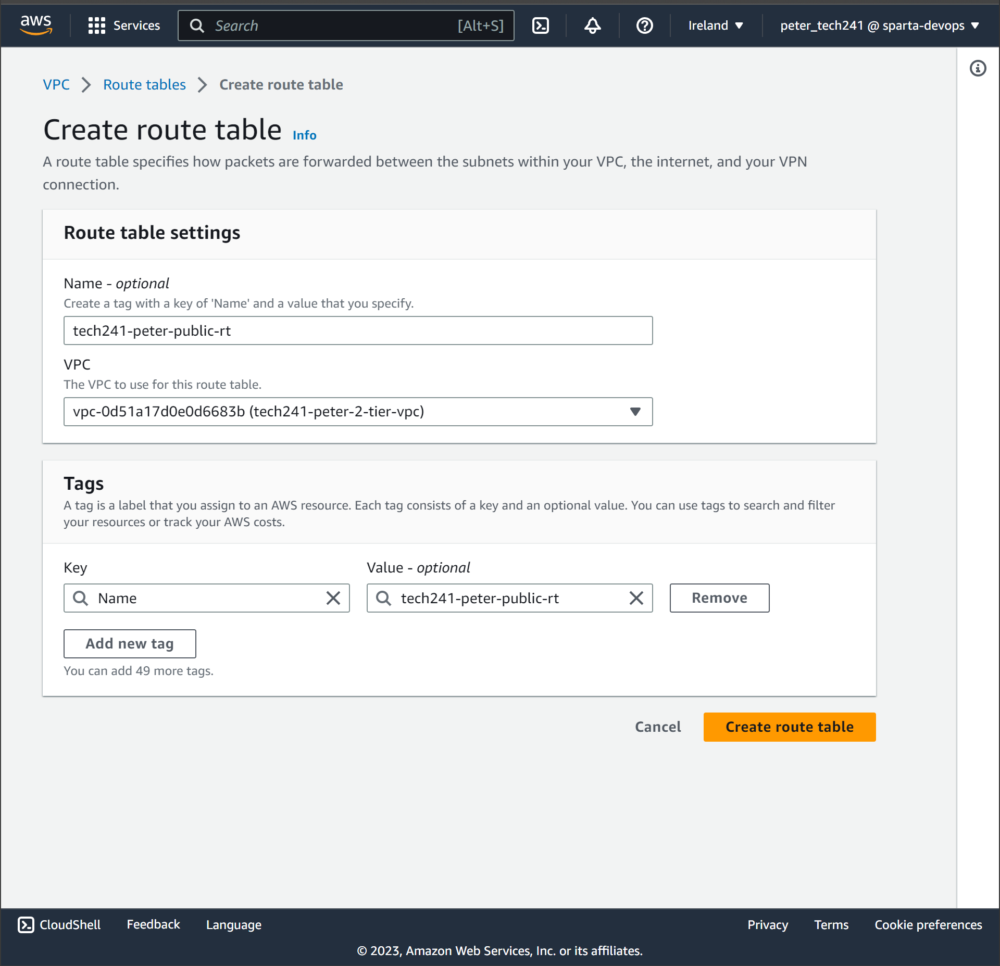

# AWS NOTES
---

## AWS vs Azure

### Resource Groups

In Azure, resource groups are **essential**. EVERYTHING must go in a resource group.

In AWS, resource groups exist, but are not necessary.

### IP Addresses

In Azure, by default, public IP addresses are static. This means they do not change.

In AWS, by default, public IP addresses are **dynamic**. This means that every time the VM restarts, the public IP address will change.

### Terminology

Azure: Create VM | AWS: Launch Instance

## LOGIN CREDENTIALS

**DO NOT LEAK THE FILE FOR LOGGING IN, YOU CAN GET FINED FOR IT**

## Logging in

When you log in, you need to make sure you are in the correct region. For us, this is **eu-west-1 Europe (Ireland)**. If you can't find your resources, check this!

## EC2

search for EC2 or select it in the sidebar.

When we are not using our VMs, the **Instances (running)** should be 0.

select instances.

---

### Creating a Key Pair

We will be sharing the same SSH Key for training. However, to set up an SSH key on AWS:

* search for key pairs
* in top right, Create Key Pair
* enter name
* Key pair type: **rsa** (same as the Azure ones we generated)
* file format (for SSH, select **pem**)
* clicking create will download a pem file. This is the **private key**, as the public key is already on AWS.

---
### Creating an EC2:

* select **Launch Instances** 
* Enter the name you want for the VM
* Select AMI
  * might have to search for it a bit.
  * Stay away from the AMIs that say "Minimal", they aren't very good, stuff missing like Nano.
  * Every image has an AMI ID (Amazon Machine Image). This can help when searching for the right one.
  * For this course:
    * ubuntu/images/hvm-ssd/ubuntu-bionic-18.04-amd64-server-20230424
    * ami-0a7493ba2bc35c1e9
* Select instance type
  * t2.micro for testing unless you need to use a bigger one.
* Select key pair
  * tech241 for this course
  
**Network Settings**

In every AWS region, there is a default network set up for you. 

* keep the default
* auto assign public IP: **enabled**

Security group is like firewall, determines traffic and ports etc.

Create security group (NSG), which we can reuse every time we make a VM.

Once we have an NSG for the app and one for the database, we won't have to make more, ie every VM we made, we had to assign the inbound port rules.

* Allow SSH traffic from:
  * anywhere (not best practice, but fine for thie course)
* Allow HTTP for the app vm, don't need it for the DB vm.
* Scroll up and click **edit** next to network settings header.
* name your security group (NB use a descriptive name so you can find it easily when creating new VMs)
    * tech241-peter-app-sg-SSH-HTTP-3000
* scroll down and click **Add security group rule**
Change port range to **3000** (the port that nodejs uses for the app)

* leave configure storage as default settings (fine for our purposes)

Push **Launch instance**

### Connecting via SSH

select VM and click **connect**

* *chmod 400 the private key (pem file) if you need to (sets no permissions for group and other)*
* copy the last command. Make sure to add the file path for the key so you can run it fm anywhere. This is best practice.

```
ssh -i "~/.ssh/tech241.pem" ubuntu@ec2-52-50-55-64.eu-west-1.compute.amazonaws.com
```
AWS has automatically set our name to Ubuntu. We did not get a chance to set the username ourselves.

* paste the command into git bash and hit enter to SSH in.
* Again, first time connecting will ask for verification, so the computer can remember and trust that address.

To stop the VM, in the Instances menu, search for the VM, go to the Instance state drop down, and select **stop instance**

If you try to connect again with the same command, you will get a **port 22: connection timed out** error. This is because there probably isn't anything at that IP anymore. IF you get this error, check your IP, and check the NSG allows port 22 connections.

Go to **connect** and copy the new command. Compare this new one with the old one:

ssh -i "~/.ssh/tech241.pem" ubuntu@ec2-34-241-161-30.eu-west-1.compute.amazonaws.com

The IP address is different! Remember that AWS by default gives dynamic IP addresses.

### Deleting a VM

select the instance, then in the instance state drop down, select **terminate instance**.

When you delete the VM, you do leave something intact: **The Security Group.** We can reuse this for future VMs.

---

### Launching Instance Screenshots

Screenshots from the second instance I launched. Using an existing Security Group.


### Connecting via SSH Screenshot


### Terminate an Instance Screenshot

## Launching Instance to run script with User Data

When launching instance, follow the previous instructions for making a ec2, but go to advanced features and paste your provision script into the user data text box.

**User data only runs once - when you create it.** When you stop and start your machine, user data will not run again.

You do not NEED to use sudo commands in user data, but it still works so probably doesn't matter, best to leave your working script be!

If you try to check to see if the script ran from user data and you get any errors/not found, **YOU PROBABLY SSH'd IN AND TRIED TO CHECK TOO QUICKLY. THE SCRIPT WAS PROB STILL RUNNING IN THE BACKGROUND. WAIT A BIT AND THEN TRY AGAIN.**

## AMI (Amazon Machine Image)

AMI doesn't have a 100% equivalent in Azure. It's a useful AWS feature for automation.

If we have a VM we want to copy, we want to make an image of it. This image is called an **AMI**.

* Snapshot of the disk.
  * Not saving everything, just making a copy of the disk
  * **Note, the AMI is the label/reference associated with the snapshot. The AMI and snapshot go together but are not the same thing.**

Once we have the image, we can use it to recreate the VM we took an AMI of.

### Making an AMI

**To get to the AMI page:**

AWS > EC2 > Images (in sidebar) > AMIs

Go to the instance summary. Then Actions drop down> images and templates > create image

* name (be descriptive)
* description (be descriptive lol)
* add tag, make it same as the image name.
    * Key: Name; Value: same as AMI name

Back to Images>AMis in the sidebar to get to the AMIs window.

### Using an AMI to Create an Identical VM

AMI summary>Launch instance from AMI

There are other ways to do this, but the benefit of doing it this way is that you don't have to go hunting for your AMI. LAunching instance from AMi from the AMI summary page autofills this field. You still have to do the rest of the settings yourself, but you don't have to do anything with user data in advanced settings as the AMI has copied this.

You will have to change root to Ubuntu(or whatever the normal username is), because logging in as superuser is not good practice for security.

Creating a VM from an AMI is good because it costs less.

---

## Monitoring

### Enabling Monitoring and Alert Management

Instance Summary>Monitoring>Manage Detailed Monitoring>Tick "Enable">Confirm

(this costs more, but you can go back and switch it off)

### Setting up a Dashboard

Instance Summary>Monitoring>Add to Dashboard

Create new>Name (be descriptive)>Create>Add to Dashboard

---

### Creating an Alert

Follow these steps to create an alarm based on CPU usage:

1. Go to the CloudWatch console by visiting https://console.aws.amazon.com/cloudwatch/.
2. In the navigation pane, click on "Alarms" and then "All Alarms".
3. Click on "Create alarm".
4. Choose "Select metric".
5. In the "All metrics" tab, select "EC2 metrics".
6. Choose a metric category, such as "Per-Instance Metrics".
7. Find the row that corresponds to the instance you want, listed under the "InstanceId" column, and CPUUtilization in the "Metric Name" column. Check the box next to this row and click "Select metric".
8. Under "Specify metric and conditions", choose the desired statistic, such as "Average", a predefined percentile, or specify a custom percentile (e.g., p95.45).
9. Select a period, for example, "5 minutes".
10. Under "Conditions", set the threshold type to "Static".
11. Specify "Greater" for "Whenever CPUUtilization is", and enter the threshold percentage that will trigger the alarm to go to the ALARM state when CPU utilization exceeds it (e.g., 70).
12. Click on "Additional configuration". Specify the number of evaluation periods (data points) that must be in the ALARM state to trigger the alarm. If both values match, the alarm will go to the ALARM state when that many consecutive periods are breaching.
13. To create an M out of N alarm, where the first value is lower than the second value, specify the desired values. Refer to "Evaluating an alarm" for more information.
14. Choose how the alarm should behave when some data points are missing under "Missing data treatment". For more details, see "Configuring how CloudWatch alarms treat missing data".
15. If the alarm uses a percentile as the monitored statistic, a "Percentiles with low samples" option will appear. Use it to decide whether to evaluate or ignore cases with low sample rates. Choosing "ignore (maintain alarm state)" will always maintain the current alarm state when the sample size is too low. Check "Percentile-based CloudWatch alarms and low data samples" for more information.
16. Click "Next".
17. Under "Notification", choose "In alarm" and select an SNS topic to receive notifications when the alarm is in the ALARM state.
18. To send multiple notifications for the same or different alarm states, click "Add notification". To disable notifications, choose "Remove".
19. Once done, click "Next".
20. Provide a name and description for the alarm, ensuring that the name contains only UTF-8 characters and doesn't include ASCII control characters. The description can include markdown formatting, which will be displayed only in the alarm Details tab in the CloudWatch console. Markdown can be useful for adding links to runbooks or other internal resources.
21. Review the information and conditions under "Preview and create". Confirm that everything is as desired.
22. Finally, click "Create alarm" to create the alarm.

---

## S3


Simple Storage Service

More or less analogous to Blob storage in Azure.

S3 uses Buckets instead of Storage Containers. Similar analogy to the bed - chucking things into a bucket.

Documentation: https://docs.aws.amazon.com/cli/latest/reference/s3/

High Level Commands: https://docs.aws.amazon.com/cli/latest/userguide/cli-services-s3-commands.html#using-s3-commands-delete-buckets


### Creating s3 Buckets

Dependencies:

* Install AWS CLI


Aws CLI commands start with aws

```
aws configure
```

Enter AWS Access Key ID, and secret key. **DO NOT SHARE OR LEAK THESE! THE CONSEQUENCES ARE AS BAD IF NOT WORSE AS LEAKING LOGIN DETAILS.**

Enter region and output.

### Create a bucket:

```
aws s3 mb s3://tech241-peter-bucket --region eu-west-1
```
### Upload something to a Bucket

```
aws s3 cp testfile.txt s3://tech241-peter-bucket
```
cp = copy. Effectively a copy to the bucket.

### Read/Retrieve info from a Bucket

```
aws s3  sync s3://tech241-peter-bucket s3_download
```
sync = download the bucket. You have to specify the folder in the command. In this case, we have called the folder *s3_download*.

### Deleting a Bucket

Delete a file within a bucket:
```
$ aws s3 rm s3://tech241-peter-bucket/testfile.txt
```

AWS does not like deleting buckets that are not empty. .

```
aws s3 rm s3://tech241-peter-bucket --recursive
```
To delete a bucket:
```
$ aws s3 rb s3://tech241-peter-bucket
```

## Using python scripts with s3

### Create an s3 bucket with a python script

```python
# 1. Import boto3 library
import boto3

# 2. set up a s3 connection
s3 = boto3.client('s3')

# 3. Create a bucket in the correct region (eu-west-1)
bucket_name = s3.create_bucket(Bucket="tech241-peter-python-bucket", CreateBucketConfiguration={"LocationConstraint":"eu-west-1"})

# 4. print bucket name to confirm the script worked correctly.
print(bucket_name)
```

### Upload to an s3 bucket with a python script

```python
# 1. Import boto3

import boto3

# 2. Set up a s3 connection
s3 = boto3.client('s3')

# 3. Upload specified file to the specified bucket and give it a specified filename.

file_upload = s3.upload_file("testfile.txt", "tech241-peter-python-bucket", "testfileupload.txt")
```

### Read/Download a file from a s3 bucket with a python script
```python
# 1. import boto3
import boto3

# 2. set up connection to s3

s3 = boto3.client('s3')

# 3. Download specified files from specified bucket

file_download = s3.download_file("tech241-peter-python-bucket", "testfileupload.txt", "testfiledownload.txt")
```

### Delete a file from a s3 bucket with a python script

```python
# 1. import boto3

import boto3

# 2. set up s3 connection

s3 = boto3.client('s3')

# 3. Delete item in bucket

item_delete = s3.delete_object(Bucket="tech241-peter-python-bucket", Key="testfileupload.txt")
```

### Delete a s3 bucket with a python script

```python
# 1. import boto3

import boto3

# 2. set connection to s3

s3 = boto3.resource("s3")

# 3. delete bucket

bucket = s3.Bucket("tech241-peter-python-bucket")
response = bucket.delete()

# 4. print response to confirm script has worked correctly.
print(response)
```
---

## Why script these tasks?

Consolidation of knowledge, as there are multiple ways to accomplish these tasks, such as using the AWS interface.

These scripts can be used as part of a larger infrastructure or application. If you had to go through and delete thousands of buckets for example, you could run it with the script to save a ton of time and free up manpower for other tasks and activities.

---

## Auto-Scaling Builds

We want our VMs to be resilent. Under high enough demand, if the CPU load is too high, things might stop working - Crashes, delays, long load times etc.  

We can combat this in different ways.

1. (Worst) CPU load is too high and causes the VM to crash.
2. We set up a monitoring dashboard (CloudWatch on AWS). This is good as we can tell if something such as the CPU Utilisation is too high. However, you would need somebody to sit and watch this all day. This introduces human error. Pretty awful/boring job, person could miss things or not respond in time.
3. To combat this, we set up an alarm to notify us when the CPU load (for example) exceeds threshhold. Better solution, but we have to be able to see the notification, by having our phone or computer available.
4. This is where **Autoscaling** comes in. If the CPU load hits the threshhold, we can set up autoscaling to address this automatically.

There are two types of autoscaling:

1. Up/Down: The task is moved to a bigger machine that can handle it better
2. Outward: More machines are activated to provide the resources necessary to handle the demand.

### AWS Autoscaling Groups

**Benefits:**
* Scalability
* High availability

Similarly to creating an AMI from a VM, we can also create a **Launch Template**. When we created a VM from an AMI, we still had to fill in all the other details such as size, security groups etc. Launch template has all these settings saved, so they are faster to make.  
(**NB**: You don't have to use an AMI to make a launch template, it's fine to use a standard image if you want/need)

Launch templates are what Autoscaling Groups need.

An ASg (*autoscaling group*) needs to know what threshold to monitor before it creates new machines. This is called the **Scaling Policy**

* What metrics need monitored?
* What is the minimum nuber of instances that can be running (for us, 2)
* What is the desired number of instances to be running (for us, 2)
* What is the maximum number of instances that can be running?
  * Think about cost to business. Business needs to decide how much they want to be spending, and can set the max accordingly.

**What does an ASG need to work?**

We have traffic coming in (example: from the internet), connecting to our app. This connects to the **Load Balancer**. The ASG creates VMs based on the mininum amount specified. The load balancer balances the load between the existing VMs.  
To make the ASG have **high availability**, we can set it to make the VMs in different **zones**, so for example there are three availability zones inside the Ireland region on AWS. If it had to create more VMs, it would just continue to loop through the three availability zones in the region.

If you delete a VM and the ASG boes below the min, the ASG will make another one to meet the minimum.

---

## Virtual Private Cloud (VPC)

Up until now we have all been working in the same network (house). Not ideal for security.  
We can set up a VPC, which is our own house. We can set up our own security and determine who is allowed in what subnets (rooms).  
If we don't set up routes (paths), then the security will default to private.  
We have to therefore set up routing/paths to the areas we want to be public.

### Diagram


Note: In production, don't open/allow any ports that aren't absolutely necessary!!  
In real world, you might use a Bastion Server to SSH into your VMs.  

## Creating a VPC

1. Create Vpc
   1. Search **VPC** to get to the VPC window
   2. Click **Create VPC**
   3. VPC only
   4. Name (tech241-peter-2-tier-vpc)
   5. Set CIDR (10.0.0.0/16)
   6. Click **Create**
   
2. Create Internet Gatweway
   1. Navigate to **Internet Gateways**
   2. Click **Create Internet Gateway**
   3. Name (tech241-peter-2-tier-vpc-igw)
   4. Click **Create**
3. Attach IGW to VPC
   1. On the screen immediately afgter creating the IGW,
   2. actions
   3. attach to a vpc
   4. search for the right vpc
   5. click **attach**
4. Create Subnets
   1. Navigate to subnets
   2. Click **Create Subnet**
   3. search for your VPC
   4. Subnet Settings 
      1. Create public-subnet
      2. specify availability zone
      3. Specify CIDR Block (10.0.2.0/24)
      4. Repeat steps for private-subnet with different Name, Availability zone, and CIDR Block (10.0.3.0/24).
   5. Click **Create Subnets**
   
5. Set up public route table (no need to set up default route table; it's already set up by AWS, it allows internal communication.)
   1. Navigate to **route tables**
   2. click **Create**
      1. name (tech241-peter-public-rt)
      2. select VPC
      3. Click **Create**
   
6. Set up association to public subnet
   1. On page immediately after creating route table
      1. go to **subnet associations** tab
      2. click **edit subnet associations**
      3. select **public-subnet**
      4. click **save associations**
7. Add route from gateway to public subnet
      1. go back to subnet associations and check it worked.
      2. go to **routes** tab
      3. click **edit routes**
      4. **add route**
      5.  set it to anywhere (0.0.0.0)
      6.  add your igw
      7.  click **save changes**
   

After you have followed all these steps, you should be able to see this resource map in the details of the VPC:


### Adding VMs to our VPC
1. Put app VM in the public subnet
   1. navigate to EC2 instances
   2. **launch instance**
   3. name (tech241-peter-app-only-vpc)
   4. Use AMI (tech241-peter-app-for-asg-ami)
   5. rest of settings as before (t2 micro, key pair etc)
   6. Network Settings
      1. click **edit**
      2. select your VPC.
      3. select **public-subnet**
      4. enable puclic IP
      5. you have to **create a new security group**
      6. name (tech241-peter-app-only-vpc-sg-SSH-HTTP-3000)
      7. copy name to description
      8. add HTTP port rule
      9. add port 3000 rule
   7. paste in **start-only** provisioning script (remove export db_host command for the app only VPC)
   8. **launch instance**
2. Put DB VM in the private subnet
   1. **launch instance**
   2. name (tech241-peter-db-vpc)
   3. use DB AMI
   4. Edit network settings
   5. select your VPC
   6. select **private-subnet**
   7. enable auto assign public IP (probably pointless here)
   8. Create new security group
      1. name (tech241-peter-db-vpc-sg-SSH-27017)
      2. copy name to description
      3. Allow SSH
      4. Allow port 27017
3. Create another app vm following the previous instructions above, but make sure to put the export DB_HOST line back into the user data when you paste it over, and also input the DB VM private IP into that line too.

---

## VPC Research Task

### What are VPCs?

In AWS, a VPC allows you to create your own isolated virtual network environment, where you can launch and manage your cloud resources like virtual servers, databases, and storage. It's like having your own digital world within AWS, where you can control network settings, security, and connectivity options. VPCs on AWS are a fundamental building block for organising and securing your cloud infrastructure.

### Why use a VPC?

1. Security - isolated and gives you control over access
2. Customisation - tailor network settings, define resources like RPs, subnets, and IGWs.
3. Connectivity - secure connections between cloud resources and on prem infrastructure.
4. Scalability - can expand VPC and adjust network configurations.
5. Compliance - meet compliance requirements by adding security measures, access controls, and auditing mechanisms. Important for industries like finance where there are specific regulations.

### Business Benefits

1. Better security - reduce risk of unauthorised access and hacks etc.
2. Cost effective - pay for what you use, reduce unnecessary spending on infrastructure that doesn't get used. Also helps with scalability.
3. Global reach - because cloud is available globally thanks to data centres across regions and zones, apps can be deployed closer to where their users are, which gives better performance.

### DevOps Benefits
1. Collaboration - VPC acts as a shared environment and common "workspace" where devs and ops can work together.
2. Facilitation of CI|CD - Seamless integration and deployent of new software updates. Devs can also test their code in isolation before deploying to production.
3. Facilitation of IaC - VPCs allow infrastructure to be defined and managed with code. Setup, config, and deployment can all be automated.
4. Scalability - Can create more or less resources within a VPC based on demand. Reduces disruptions caused by demand.
5. Monitoring - Applies to more generally to cloud services, but VPCs have monitoring and troubleshooting tools that can be used to track metrics and find/solve issues.

### Why AWS Introduced VPCs
AWS introduced VPCs to address the need for secure and customizable networking in the cloud. By providing isolated virtual networks, businesses gained enhanced security, greater control over network configurations, and improved connectivity between on-premises and cloud environments. VPCs allowed AWS to meet the evolving demands of customers and provide a more comprehensive and flexible networking solution within their cloud infrastructure.


---