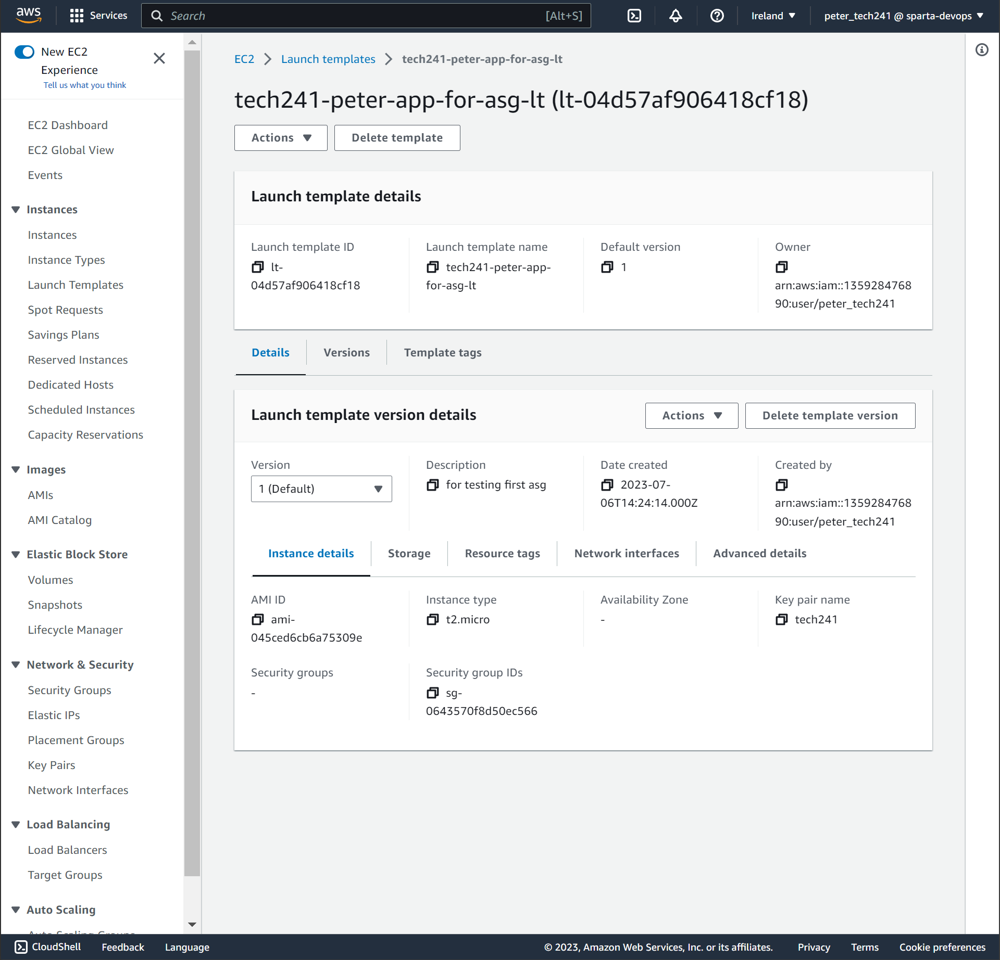
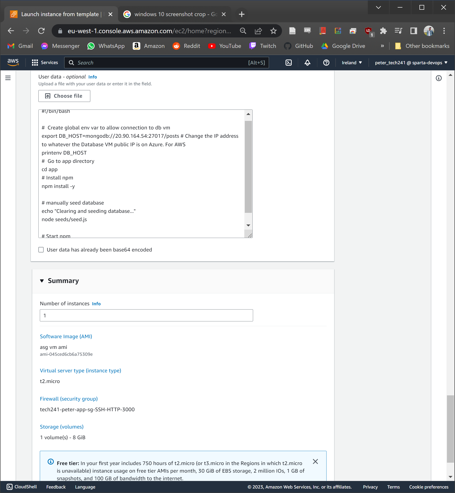
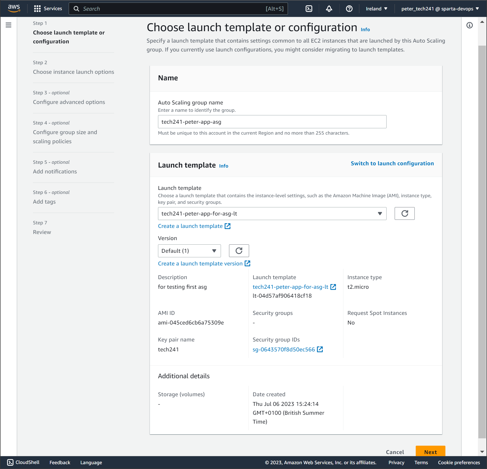
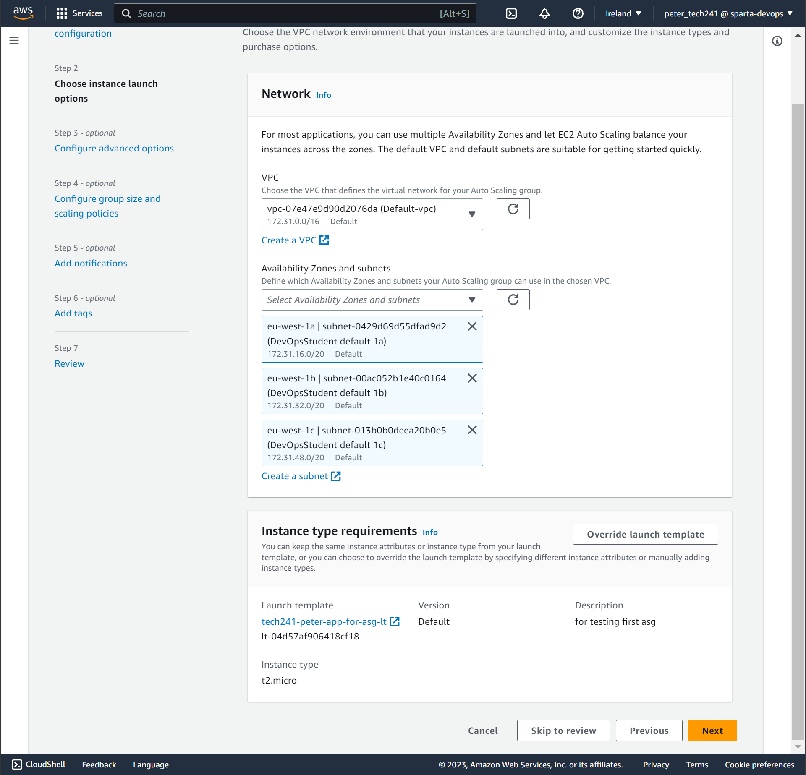
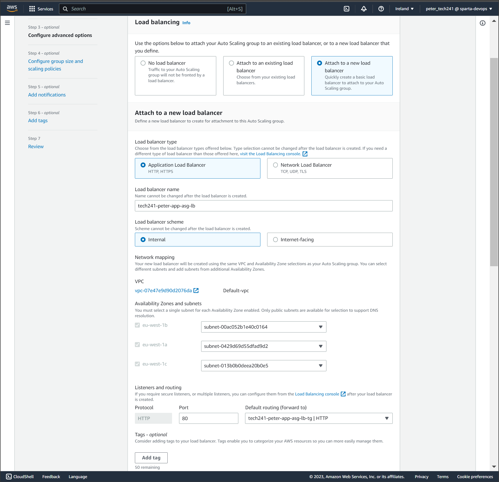
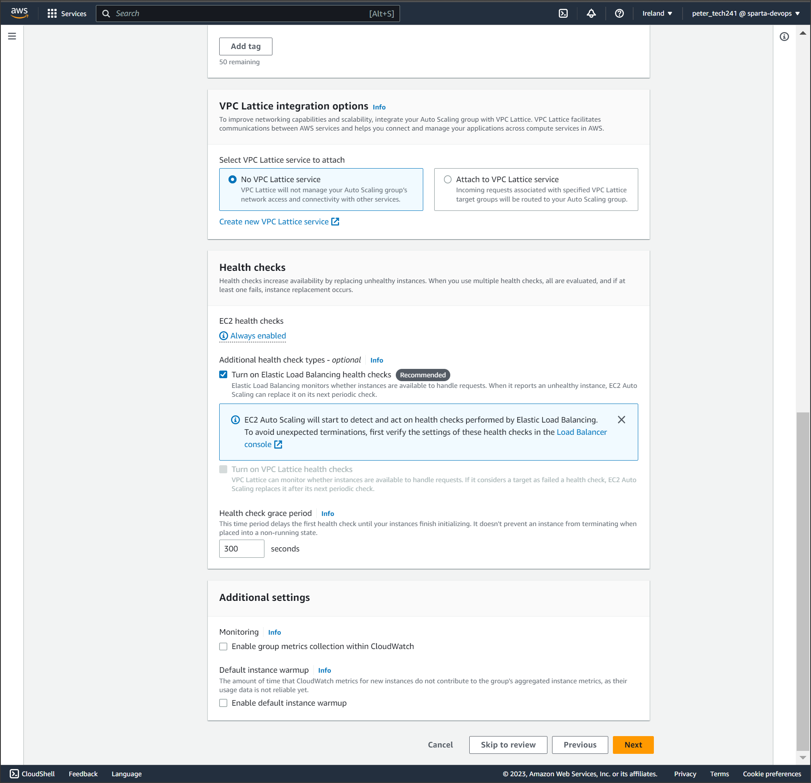
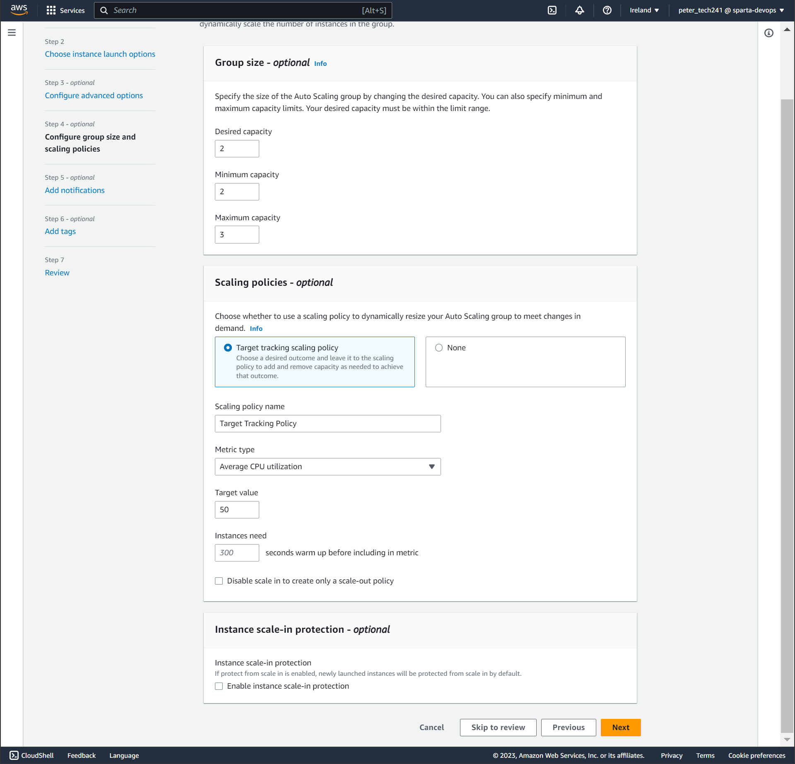

# Sparta App AWS

###### Refer to the notes on creating VMs (Instances) in AWS in the AWS repo> aws_notes.md

## Running the App

The process of getting the app to run on AWS VMs was very similar to on Azure. I created provision.sh in both VMs, pasted the scripts in, ran the db script, then the app script, and the app worked!

However, as soon as I restart my VMs, especially the DB VM, the app will no longer work. This is because the app script relies on the DB VM public IP remaining the same (static). This is not an issue in Azure since static IP addresses are default, but in AWS IP addresses are dynamic by default. Restarting the DB VM will assign it a new IP address, and this will have to be copied into the app script every time. This might be fine, but in many instances, this will be unnecessarily time consuming, and is a hindrance in our quest as DevOps engineers to automate as much as possible.

What is the fix for this???

### Using a public IP address vs a Private address

Up until now, we have been using the public IP addresses to connect our apps together. As mentioned, with AWS, the public IP address is dynamic and therefore changes every time you stop and start the VM. This causes problems for automating it.

When you go in through the public IP address, you have to go through the network security group every time, you have to be trusted every time. However, because our VMs are both within the same house (virtual network), we can use the **private** IP address. The network interface cards associated with each VM can talk to each other. Things within the same VNet can talk to each other via their private IP addresses.

Furthermore, because we are only using internal communication within the VNet, we don't even need to specify allowing the port 27017 in the database NSG. 

We specify the DB VM private IP in the environment variable command in the app VM.

Private IP addresses only work inside an internal network. Because our VMs are in the same VNet, The App can speak to the DB, but putting the private IP in a browser would not work as that would be trying to access it from the outside.

If you put the App VM IP (public or private) into the env var command for DB_HOST, it would not work because it would try to use the app VM to access the DB.
### A quick note on IP addresses
HTTPS - port 443  
HTTP - port 80  
SSH - port 22  
mongodb - port 27017
---

## Setting up AWS Autoscaling Groups

1. Get the db VM running
2. Create a new instance for the App
   * use the provision script for the app in user data.
   * make sure the db vm private ip is pasted in for the DB_HOST env var command
3. Wait while the app starts up in the background. You'll get the "welcome to nginx" and "502" screens before the setup is complete.
4. Create an AMI of the app VM you just created.
5. Go to the **Launch Templates** window and click **create launch template**.
   1. Name it (tech241-peter-etcetcetc)
   2. description
   3. select AMI you just made
   4. fill out rest of details like you do when creating an instance
   5. **AMI does NOT copy user data, user data runs only once**
   6. We do not need to put the entire provision script in the user data. Most of the stuff in the script will be saved, but we will need to run the app.
   7. See new version of the provision script: [label](../linux/provisionapp_onlystart.sh)
   8. create launch template

Launch Template details should look like this once created:
   
6. in launch template window, select launch template>actions>launch instance from template:
   1. notice everything is already filled in for us
   2. make sure to name it in resource tags, saves you doing it manually later and creating confusion if you have an asg!  
7. **We used the modified short version of our script and the AMI of our VM where the rest of the script is set up because it makes the setup of the VM faster. It's ideal for the VM to be created as quickly as possible in an ASG. **

**TEST THE LAUNCH TEMPLATE BEFORE YOU MAKE THE ASG!!!**

1. Create the autoscaling group
   1. navigate to the asg window
   2. click create
   3. name
   4. select launch template you just made
   
   5. *next*
   6. select VPC (we left it alone this time)
   7. select availability zones
   8. instance type requirements (left this alone too)
   
   9.  *next*
   10. **load balancer**
       1.  we created new load balancer
       2.  application load balancer
       3.  name (tech241-peter-app-asg-lb)
       4.  for us, we need **internet facing** because we are dealing with http traffic coming fom the internet.
       5.  create a target group>name (tech241-peter-app-asg-lb-tg)
       6.  turn on elastic load balancing health checks
   
   
   11. *next*
   12. set desired, minimum, and maximum in group size
   13. set scaling policy
   14. set up notifications if you want
   15. Set tags
       1.  name
       2.  tech241-peter-app-asg-HA-SC
   
   16. Review and then click create
2.  go to load balancers window
3.  copy DNS name and paste into new tab to check if it's working

### terminating a vm inside an ASG

have to delete the asg and load balancer separetely otherwise the load balancer will remain.