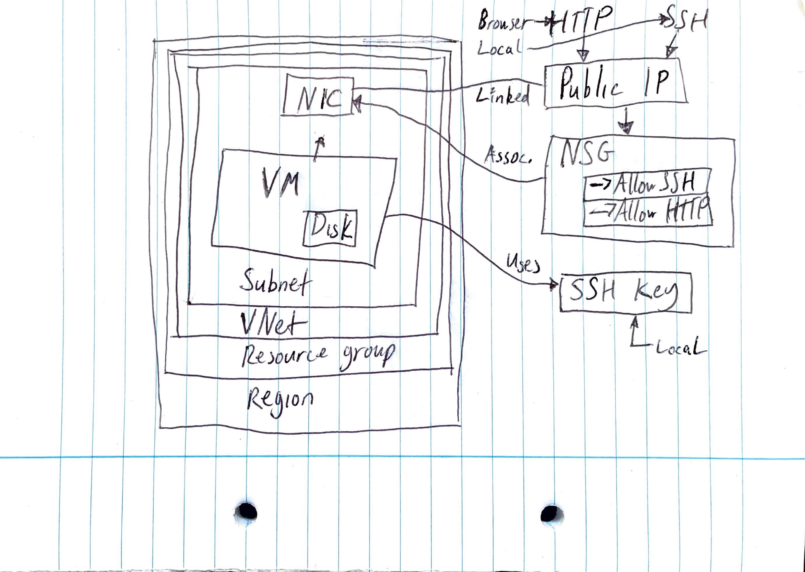
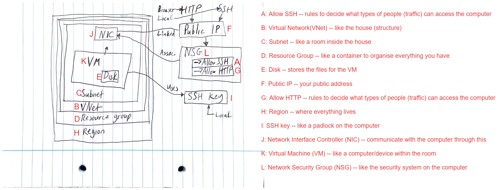

# Azure Notes
---
## What is the Cloud?

**The cloud is services and resources that are available *ON DEMAND* and are provided over the internet.**

*On prem – servers at the office or branch.*

*On cloud – Data centers*

Cloud is centrally managed, delivered as a service over the internet.
You don’t have to be a super techy person in order to use cloud services.
Data centres have their own cooling (water supply) and power (stored in batteries in case things turn off), networking.
The data centres need to be a certain distance from each other in case of *disasters*. So different regions. 

---

### Advantages of Cloud?

* Data security. Data centres have extremely tight security.
* Economy of scale. Sheer scale and size of cloud means prices are affordable.
* Similarly, cloud often follows a pay for what you use model.
* Battery backup. On prem less likely to have this, so extra safety measures like this are included in price for cloud.

### Disadavantages of Cloud?

* Single point of failure, theoretically. If tomorrow morning, AWS just disappeared, global economies and society would probably collapse.
* Not always cost effective? It depends on individual business and their use case.
* For hybrid and multi cloud, a disadvantage is increased complexity. This will require multi-cloud experts to be able to operate systems, which will require paying bigger salaries.

---

### CapEx vs OpEx

Good to consider this when discussing Adv and DisAdv:

Capital expenditure is upfront costs. On prem, CapEx is usually high as you have to buy all of the server equipment etc. This will also eventually need replaced etc.

Operating expenses are spread out per month/year.

With **CLOUD** OpEx is greater than CapEx usually. CLoud is almost completely OpEx with a monthly bill.

With **On Prem** there is mostly CapEx, but you still have OpEx to keep things running, such as paying people, new parts etc.

---

### Tags

Tagging is a way of organizing your cloud resources by categorizing them according to certain key values.

Team: Sales 1

If you do that with all resources associated with that team, even if all of teams do this, then these resources will be grouped in the billing according to the tag.

---

### Types of Cloud

1. Private Cloud (single-tenant) – server dedicated for a private company. Can be used without internet eg on a cruise ship.

2. Public Cloud (multi-tenant)  – server shared, but each user won’t know who else is on the server.

3. Hybrid Cloud – mix of on-prem and public-cloud. Eg database that runs on own office server, web app running in Azure/AWS, but it connects to the on-prem database.

4. Multi-Cloud -  Using multiple cloud providers for different tasks. Eg running database on Azure, with a backup on AWS.

---

### Types of Cloud services

More control -> Less control

More things to worry about -> Less things to worry about

- On prem:
You have to manage everything.

- Infrastructure as a Service (IaaS)
You manage data, applications, runtime, middleware and OS.
Platform manages virtualisation, servers, storage, and networking.
Example: Azure, AWS

- Platform as a Service (PaaS)
You manage data and applications.
Provider manages everything else.
Example: SQL Database, Github.

- Software as a Service (SaaS)
You manage data.
Platform manages everything else.
Example: Office365

---

### Total Cost of Ownership
TCO calculator. Using cloud is cheaper ONLY DEPENDENT ON INDIVIDUAL CASES

---

### Market Share

AWS, Microsoft and Google are the Big 3.

$23Billion for AWS (not even including SaaS etc), lot of money involved!

Which one is best? - AWS biggest, but Azure has full Microsoft integration!

It’s hard to get expertise on the smaller cloud providers. IF you want more of a niche with your career, maybe look into specialising in one of the smaller cloud providers. AWS is big but it means that more people are trained in it.
Google cloud experts are fewer and can therefore get a higher salary.

---

---

## What is Azure?

Management groups help you manage access, policy, and compliance for multiple subscriptions. All subscriptions in a management group automatically inherit the conditions applied to the management group.

Subscriptions logically associate user accounts with the resources they create. Each subscription has limits or quotas on the amount of resources it can create and use. Organizations can use subscriptions to manage costs and the resources created by users, teams, or projects.

Resource groups are logical containers where you can deploy and manage Azure resources like web apps, databases, and storage accounts.

Resources are instances of services that you can create, like virtual machines, storage, or SQL databases.

(AWS you do not have to use resource groups).

Azure you MUST have a resource group. Cannot put resources in nothing.

---

## Branches of Azure
### AI

- Deploy pre-trained models
- Machine learning
- Bot service

### Storage

- file
- archival
- blob
- disk

### DevOps

**NB: Azure DevOps is its own separate thing. More on this later.
- Testing
- Boards
- Pipelines
- Repos
- Artifacts

There are a lot of security features built into cloud services such as ***** for secret variables/sensitive stuff etc.

### Network

- Load balancer
- VPN
- VNet

### Big Data

- Complex queries
- Analytics

### Compute

- Web apps
- VMs
- Mobile apps

### Mobile

- apps
- notifications

### Internet of Things

- Manage devices
- Connect

### Web

- APIs
- Web apps
- map services

### Databases

- proprietary (made by a company, you need to pay for it)
- open source engines (anyone can get the code, run, update, modify, improve etc. Free (free license to use it, still need to pay Azure for the service))

---

**This week we will be working mainly with Compute, Network, and Storage**

---

### Accessing Azure

#### 4 methods:

1. Portal - log onto portal.azure.com with Sparta details.
2. Command Line Interface (CLI)
3. PowerShell
4. Other services/tools

All have to go through the Azure Resource Manager (ARM). ARM is like an API, so it interfaces betwen portal/azure cli/powershell and Azure.

**Principle of Least Permissions** = **Only use the minimum amount of access required for the job.**

---
### Virtualisation

#### What is Virtualisation?
Virtualisation is a process that allows a computer to share its hardware resources with multiple digitally separate environments. Virtual environments can be allocated resources such as memory, CPU, and storage.

#### Virtual Machines (VMs)
A VM is a digital version of a physical computer. It runs on an "image" of an operating system, and has the same resources as a physical computer (although as mentioned, these are allocated/borrowed from the computer the VM is being run from).

VMs can be run on servers, on desktops, and on embedded platforms. 

As mentioned, VMs are allocated resources by their host. Therefore, the resources the host has affects how many VMs can be run.

The requirements of the VM similarly affect this. If a VM needs a larger allocation then it means fewer of those VMs can run.

The hypervisor (the software that manages the VM) also plays a part. Different hypervisors have different limits on their capability and scalability.

To orchestrate and run virtual machines (VMs), you need a virtualization platform or hypervisor. Popular options include VMware vSphere, Microsoft Hyper-V, KVM, Xen, Proxmox VE, and Oracle VM VirtualBox. The choice depends on factors such as the operating system, specific requirements, and desired management capabilities.

An image is needed to create a VM. This is a blueprint of an Operating System with the configurations needed for the virtual environment. It is essential for VM creation as it provides consistency, efficiency, reproducibility, scalability, versioning, and simplified management. It streamlines the process of creating and deploying VMs, enabling faster and more reliable provisioning of virtualized environments.

#### Virtual Network

Consider a vnet like your house. There is security there. The subnets are like breaking up the houe into different rooms. Can one room overlap onto another? Nope. Make sure the ranges for each subnet do not overlap. 

---

### Creating a Virtual Machine

1. Set up security.
    - create SSH key pair on local machine, then put the padlock part onto Azure.
    - We need to specify this every time we log on to it.
    - create folder where all keys will be stored
        - .ssh (hidden directory)
    - generate ssh key pair
        - $ ssh-keygen -t rsa -b 4096 -C "email" 
        - enter filename (tech241-peter-az-key)
            -( az = Azure)
    - enter passphrase if desired
    - this generates public version of the key
    - go to Azure portal, get on the SSH keys page
    - create, paste in pub key
2. Go to Virtual Machines
    - Create
    - Azure Virtual Machine
    - select resource group
    - name 
    - region: UK South
    - security type: no required
    - standard security
    - Image (select base OS)
    - VM architecture
    - size
    - auth type
    - enter key details  
    - inbound port rules
    - Disks
    - OS disk type
    - Other tabs if necessary
    - Tags
    - Review and create
3. Build SSH into the VM
    - in VM overview, click on Connect
    - connect via ssh
    - go back to git bash
    - chmod 400 tech241-peter-az-key
    - go back to azure portal and add this to private key path
    - ~/.ssh/tech241-peter-az-key
    - paste command back into git bash
    - authorise
    - you are now logged in
    - type exit to exit
    - in VM overview, press stop to stop machin (good practice when not in use, it costs money!)

## VM Diagram

Network security group is connected to the network nterface controller and the public IP. They protect the VM because you have to get through the NSG with the public IP to get through the NIC to get into the VM.

There is a different way to set up a NSG. You can associate it **directly with the subnet**. IE you can set up your security guard to protect the room itself.

## Azure vs AWS for VMs

Azure has static IP address by default. SO the IP will stay the same even when restarting that VM.  AWS has dynamic IP address by default! SO every time you stop and start your machine in AWS, you will need to get the right IP to SSH in.

---

## Two Tier Architecture on Azure

Monolithic architecture is all in one huge "chunk", it's all within the same thing. Eg you might have an app with a payment system, shopping cart, inventory system etc. ALl of it is hard coded into a single application.

In the last decade, trends have pointed towards microservices. So for example, you would have the payment system as its own entity (this could even be done by its own dedicated dev team), and same with shopping cart etc. They may all even be made in different languages.

This is called loose-coupled.

You would need a central app to be able to use all of this, but the app would be able to talk to all of the different microservices.

There are adv and disadv to both monolothic and loose-coupled.

The Sparta App we deployed was deployed on **TWO TIER ARCHITECTURE**, since we have a VM for the app and a VM for the database. 
In the previous example, the payment method could be made using this two tier architecture. There are differing opinions on what counts as a "tier", whether something should be classed as one or two tier etc.