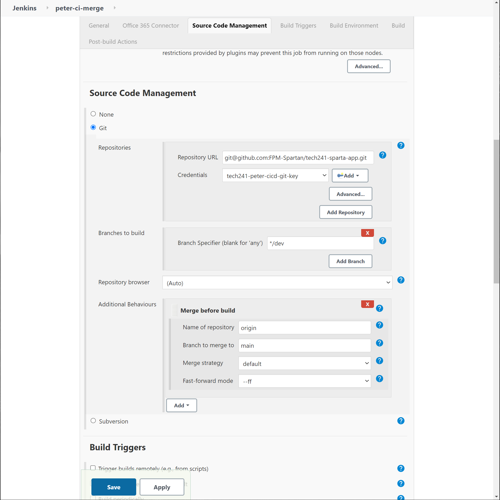

# CI/CD Notes

## Overview


### What is CI/CD?

CI/CD stands for **Continuous Integration | Continuous Development**.  
It is the process of automating across the software development lifecycle and is the cornerstone of DevOps.  
    **Software Development Lifecycle:**

    Plan;  
    Design;  
    Develop;   
    Test;  
    Deploy.

CI/CD is about automating most of the points where human intervention is needed in terms of getting new code from source to production.  
The two main goals of CI/CD are to **get code released faster** and **minimise downtime.** Faster code releases generate more value for the business, likewise with minimised downtimes leading to increased user/customer satisfaction and therefore more business value.

Save time -> Save money -> Profitable business.

CI/CD has value to us as DevOps engineers, because we can take a task that took us a few working days to get through, and automate that within a few minutes.  
We also use CI/CD in DevOps because it allows us to use automation to maximise development time for our team. By automating repetitive, tedious, or large tasks, we free up time and manpower.

### CD vs CDE

Continuous Delivery vs Continuous Deployment.

Continuous delivery automates right up to the point where release-ready software is ready to be deployed to production. This still requires manual approval.

Continuous Deployment is an extension of this, where the process of deploying to production is automated too. So whenever someone pushes code from their local to the github repo, the cicd pipeline kicks in and that change goes right the way through to production.

## Jenkins

Jenkins is an open source automation server. It is built using Java.  

We use Jenkins in this course to create our CI/CD Pipelines. Why have we chosen Jenkins over other tools?:  
* Open Source
* **Free**
* No dependencies
* Wide adoption and community support
* Flexibility
* Powerful plugins and mature ecosystem
* Cross-platform compatibility

CI/CD concepts are the same regardless of the tool used. We are here to understand the concepts and architecture, then the implementation.  
Other CI/CD tools include *Circle CL, TeamCity, Bamboo, Gitlab, Buddy etc.*

### Working with Jenkins

Anything we do in Jenkins is called a **job**.

**Create new job** -> new item

* name
* select build type (we did Freestyle Project)
* add a description
* Discard old builds>set max build to keep to **3** (good to keep things organised while testing)
* Build>Add build step
* We chose Execute shell to run BASH commands (uname and date to check it recognised Linux and to check the time zone Jenkins was running in for us.)
* Post-Build Actions to chain builds together. This is called a multibuild. We set it so that if our env check was successful, it would start the build for the date/time zone check.
* Save
**Run job/Create build** -> dropdown on item in list>Build now  
**Check the build worked** -> Build history>dropdown on build in list>Console log

### Master node vs Agent Node
Master node is the control node, where you deal with all of the setup like key management etc. The master node distributes the execution of tasks across agent nodes.  
The agents are the nodes where the work is done. They are isolated from the master node.


## Building a CI/CD Pipeline

### Why build a pipeline?
1. **Faster software delivery**. This is the main goal of DevOps. CI/CD pipelines automate the build, test, and deployment parts of the sd process.
2. **Better quality of code**. Automated testing is good at spotting bugs and other issues early on.
3. **Continuous feedback**. Immediate feedback is given to developers who can take quick action.
4. **Consistency**. Pipelines enforce this on build and deployment, which also helps in reproducability.


### **Step 1:** Set up public key access on the github repo.

We need to add a public key to the repo for our app on Github. This is so github can communicate with our local machine

1. Generate new SSH keys inside ssh folder on local.
2. Copy public key into GitHub repo for the app (NOT Git account).
   1. GitHub account home page>Repos>app folder>settings>deploy keys>add deploy key
   2. paste key into text box.
   3. Name it **name_jenkins**
   4. Add key

### **Step 2:** Manually setting up our Continuous Integration build on Jenkins

We need to add the corresponding private key to the public key we added to our app repo on github. This is so that when Jenkins tries to clone the app from the repo, github allows it to do so.

In Jenkins:
1. New Item
2. name (peter_ci)
3. description (good practice. *CI for nodejs app new feature + *)
4. Discard old builds (3)
5. **tick github project**.
6. Enter project URL
7. Scroll down to **source code management**
8. Enter repo URL  
**NB: Project URl is HTTPS, Repo URL is SSH**
9. Click **Add**>Jenkins
   1.  Kind>SSH Username with Private Key
   2.  Username>same name as private key
   3. Tick **Enter Directly** and paste the entire private key in (easiest to get it from nano in git bash terminal as admin)
   4. After clicking add and selecting the credentials just created from the list, any big red text error should go away.
   5. Branch > */main (change from master)
10. Build Env > tick **provide node and npm bin/folder to PATH**
11. Office365 Connector > Restrict where this project can be run
    1.  enter agent node (sparta-ubuntu-node)
12. Add these commands:
    ```
    cd app # Don't do this if the home of the repo is already the app folder)
    npm install
    npm test
    ```
13. Save
14. Build now
15. Build history>Console Output

### Step 3: Automating the CI

We create a web hook to trigger the CI job automatically. With this in place, every time changes are pushed to the repo (in our case, the app repo), the Jenkins build we just created 

1. GitHub repo>Settings>Webhooks>Add webhook
2. Paste Jenkins payload URL
   1. JENKINS_URL /github-webhook/
   2. , content type as **application/json**, leave secret empty.
3. leave as **just the push event**, make sure active is ticked.
4. In Jenkins, edit the CI build we just made. (Configure)
5. Under **Build triggers**, tick **GitHub hook triggers for GITScm polling**

(Blocker: 403 Error, SSH key steps all correct.  
Solution: make sure you have **/github-webhook/** on the end of the Jenkins payload URL in the Webhook settings on your repo.)


### Step 4: Setting up access between Jenkins and AWS.

1. Create a dev branch on localhost and link it to github.  
   Make a change to the dev branch and push the code to github - the webhook should trigger.  
   If the tests pass, the code should then be merged from dev to main branch  
   job should be called peter-ci-merge
2. Clone from main branch and push to production - AWS EC2  
   job should be called peter-cd-main

End goal is to push once from localhost and to see the changes in production.


```
git branch dev
```
Create new branch on github app repo called dev.

```
git checkout dev
```
switches from main to dev. Now when you push changes from in dev, you will push to the dev branch on github.

use git publisher and merge before build

blocker: ci-merge not working, solution: I had the http link in the repo url under SCM, but it should have been the SSH link. pasted the SSH link in and it worked.

Below are the settings used for the merge before build and the git publisher plugin.



### Step X: CD

Once code is merged to main, we need to then push it to production. We have a ssh key set up for all of us to use, but because we are automating, we have to find a way to bypass having to say yes when we give the key.

1. Set up an EC2 using the app vm AMI made during AWS week. 
   1. Make sure the security group allows SSH HTTP and port 3000(nginx). We had a security group already made.
2. My repo was the app files themselves, so I moved everything into an app folder called "spartatest" so that I could easily scp everything over.
3. Create new jenkins job called **Peter-CD**
4. Same as before with name, desc, old builds, restrict to agent node, github repo url.
5. Specify main branch
6. trigger this job to build after **Peter-CI-Merge**has been built
7. provide node etc **ticked**
8. Tick **SSH** agent. Add/select tech241.pem key
9. add the following into execute shell:
```
    # Copy app folder
rsync -avz -e "ssh -o StrictHostKeyChecking=no" spartatest ubuntu@34.244.137.17:/home/ubuntu

# SSH
ssh -o "StrictHostKeyChecking=no" ubuntu@ec2-34-244-137-17.eu-west-1.compute.amazonaws.com <<EOF
    # For app running without the db
    unset DB_HOST

    cd spartatest
    npm install
    pm2 kill
    pm2 start app.js
EOF
```


---

## Setting up Jenkins on AWS

We did the above tasks on a Jenkins already set up. Now we will set up our own Jenkins server on AWS and recreate our CI/CD pipeline.


1. Create a Security Group
2. Launch an EC2 Instance
3. Install and Configure Jenkins
4. Clean Up Setup/Test Resources

First step would typically be to create a new SSH Key, but we have one for this course already (Tech241.pem).

### Creating the security group

AWS>EC2>Network and Security>Security  Groups>Create

Name (tech241-peter-jenkins-sg), then use the following inbound port rules:


### Launching Instance

* Name (tech241-peter-jenkins-server)
* Use Ubuntu 18.04 LTS
* Select security group we just made.
* Launch

### Installing and configuring Jenkins

See the provisions made for the VM for Jenkins:
[Provision Script for Jenkins]](provision-jenkins.sh)

go to the vm IP:8080

Set up admin account and install the required plugins

#### Nodejs:
1. Manage Jenkins>Plugins>Available
2. Search for nodejs
3. install
4. Manage Jenkins>Tools
5. Scroll down to Node JS and click Add
6. Name, leave rest default except change version to 12.x as this is dependency for sparta app

Security>Git Host Key Verification Configuration:

Set to no verification.

You can now set up the CICD Pipeline as before.