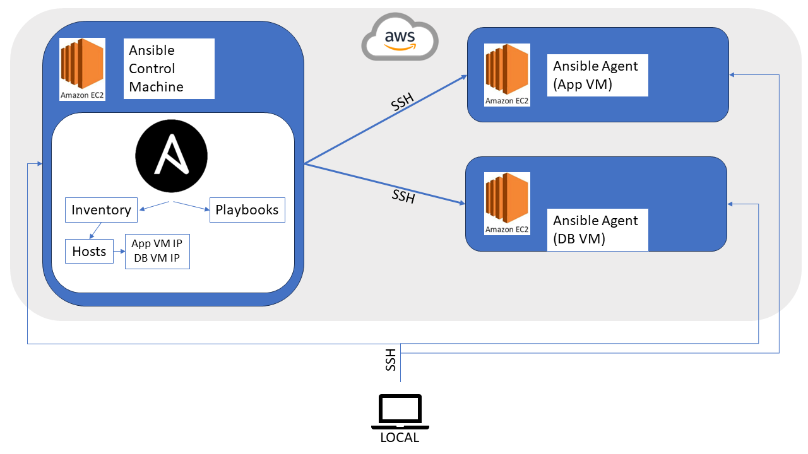
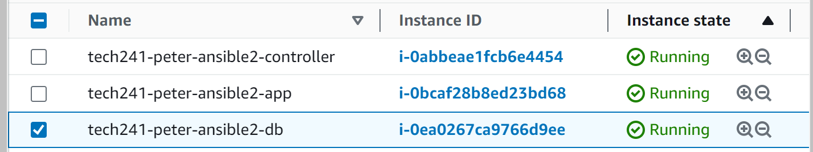
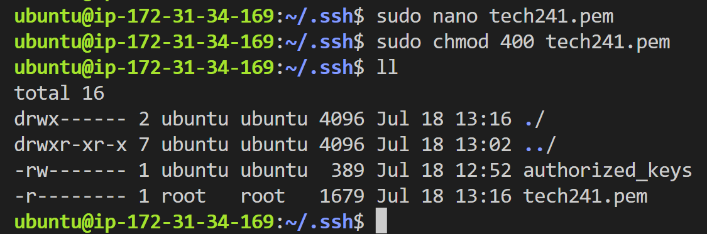
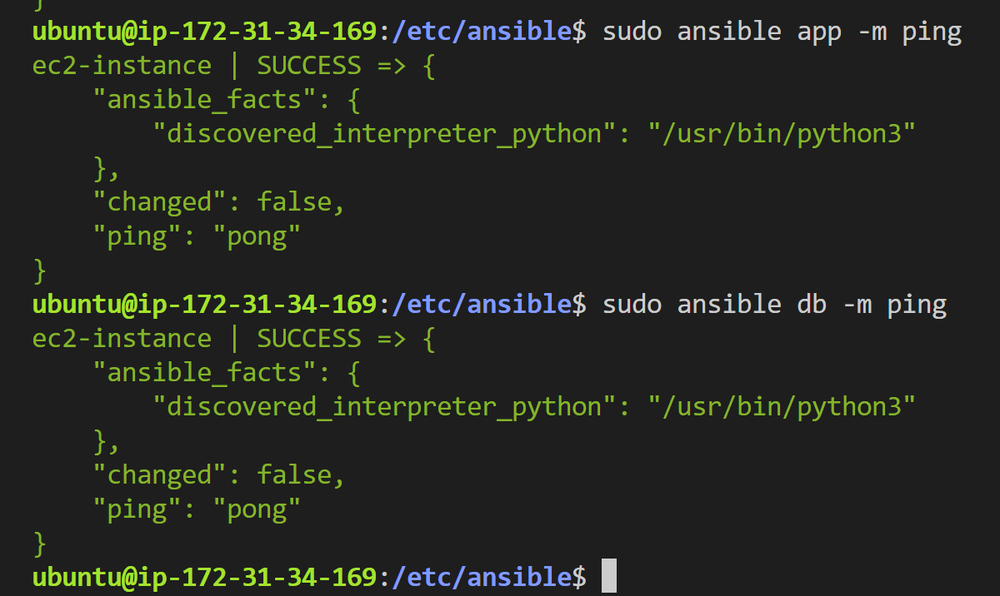

# Ansible

## Configuration Management with Ansible
### Overview
Ansible is a config management tool used heavily in DevOps and DevSecOps.

Why use Ansible? It's simple, lightweight, and it's **agentless** (The agent nodes that Ansible communicates with do not need to have Ansible installed).

### Architecture



Master node: Ansible controller (in our case, this is on AWS EC2 instance, but can be hybrid or on prem)

Agent node: we use Ubuntu 18.04 LTS. We can have as many agents as we like. Our project requires a node for the app and a node for the database. Ansible uses a method of communication to securely connect to agent nodes. We will be using SSH. Ansible **pings** the agent nodes. The ping has to get through the SSH.

Default directory structure: Inventory of hosts (eg: ip of the db vm and ip of the app vm, and **location of the pem file**), and playbooks.

Playbooks: sets of instructions 

---
## Setting up Ansible
**Dependencies:**
* AWS account
* pem file


### 1. Set up 3 new EC2 Instances
   1. name (tech241-peter-ansible)
   2. Ubuntu 18.04 LTS, t2 micro
   3. SG that allows SSH
   4. launch 3 instances
   5. Rename them in the instances list. Add **controller, app,**and **db** to the ends of them.



### 2. set up Ansible Controller
   1. SSH in
   2. Run an update (note: Ansible requires Python installed on the vm to run.)
   4. Install some dependencies that are common for any software needed. (optional)
   5. Install the Ansible repository
   6. Update again
   7. Install Ansible
   8. Check that Ansible is using Python 2.7.17
   
```
sudo apt update -y

sudo apt-get install software-properties-common -y

sudo apt-add-repository ppa:ansible/ansible -y

sudo apt update -y

sudo apt install ansible -y

sudo ansible --version

```   

### 3. Check the other two VMs can receive communications.
   1. SSH into App VM
   2. Run update
   3. Run upgrade
   4. Repeat for DB VM.

### 4. Add key to the controller.
   1. cd ~/.ssh
   2. sudo nano tech241.pem
   3. paste key in from local.
   4. chmod 400 tech241.pem
   

### 5. SSH into nodes from controller

   1. cd ~/.ssh
   2. paste ssh connection command from AWS for app vm into controller, but add **sudo** to the beginning.
   3. Repeat for DB VM.

### 6. Set up Hosts
**NB: Installing the Tree package will be helpful for viewing our file structures.**  
**sudo apt install tree -y**

1. cd /etc/ansible/

```
sudo ansible all -m ping
```
need admin | use ansible command to specify we are using ansible | -m = module | ping is the module we are using.

Doesn't work because we have not set up hosts yet.

2. sudo nano hosts
3. Add the app vm details as follows:
```
[app]
app-instance ansible_host=63.35.225.112 ansible_user=ubuntu ansible_ssh_private_key_file=~/.ssh/tech241.pem
```
4. Do the same for the db vm
```
[db]
app-instance ansible_host=54.229.62.206 ansible_user=ubuntu ansible_ssh_private_key_file=~/.ssh/tech241.pem
```
Now try the ping commands again.

```
sudo ansible app -m ping
sudo ansible db -m ping
```
**If all steps have been followed correctly, your output will be this:**



---

## Ad Hoc Commands

We use ad hoc commands to save us SSHing into all our instances. If we were working with a system that had hundreds of agent nodes, this would save us a lot of time.

Link to official documentation for ad hoc commands. There are millions of commands, but a few useful ones are listed below:
https://docs.ansible.com/ansible/latest/command_guide/intro_adhoc.html

If you feel like you are having to run these commands very often, put them in a script.


### Check the OS of agent nodes

We do this because we will not always be the creators of agent nodes. It means that we can check what OS is running on each agent node and adjust our commands accordingly (Ubuntu 18.04 commands will not run on Windows VM nodes)

```
sudo ansible app -a "uname -a"
```

### Check where the agent node is running

This is useful if, for example, you need to run an update on a weekend. You want to make sure you can select a time that occurs within the weekend for all nodes needing an update if you have nodes across multiple regions/time zones.

```
sudo ansible app -a "date"
```

### Check the available memory

We need to check that the node can handle the update. Does it have required storage space? Does it have the right amount of memory? If it does not, you can copy the results to send back to the client.

```
sudo ansible app -a "free"
```

### Check if a package already exists on nodes

```
sudo ansible app -a "ls -a"
```
### Transfer file from controller to agent node

(To test this, make a text.txt file using `sudo nano test.txt`)

Use the following command to copy the file over to the agent node:

```
sudo ansible app -m ansible.builtin.copy 
-a "src=/etc/ansible/test.txt dest=~/"
```
We specify that we are using the ansible.builtin.copy module.

We also specify the source of the file we want to transfer, and the destination we want the file to end up in. This will apply to all nodes in the "app" group.

You can check it worked by using:
```
sudo ansible app -a "ls -a"
```
---

# YAML 

YAML files start with three dashes ---

Not all YAML files start with it now but good to know if you have to read old YAML files.

Why use YAML?

AWS uses YAML  
Docker Compose uses YAML  
Kubernetes uses YAML

All very in demand and highly useful/powerful DevOps tools

One YAML Playbook can communicate with hundreds of nodes.

The key thing with this task is that we should **not** be SSHing into any agent nodes. We should be able to do most of our tasks using either ad hoc commands and yaml playbooks.

NB: Ansible is made with Python, so **INDENTATION MATTERS! BE CAREFUL!** (Case sensivity is also a thing too.)

## Using Ansible and YAML playbooks to run the Sparta App

### Create playbook to install nginx in app agent node.

**NOTE:**
Everytime you stop your EC2 instance and restart it, you will get a new public IP address. Here are the steps you need to take every time you start up the agent node VMs:
1. `cd ~/.ssh`
2. sudo + the SSH connection command copied from AWS
3. run update and upgrade either while SSHed in or using ad hoc commands from /etc/ansible
4. `cd /etc/ansible`
5. `sudo nano hosts`
6. change the ip addresses to the new ones in each host
7. save, close, and try `sudo ansible all -m ping`, you'll have to verify connections with 'yes' the first time.
8. If pong is returned for both, you are good to go.


(Make sure your app instance has port 80 (http) inbound allowed)

**Steps taken in the nginx playbook:**
* Specify the **app** host
* Gather the logs/facts
* Enable admin access
* Install nginx

**Blocker:** The playbook worked but it installed on the DB agent node and not the App agent node.  
**Solution:** I discovered the issue was that I had used the same hostname, "ec2-instance," for both the "app" and "db" groups in my Ansible hosts file. This caused Ansible to treat them as the same host and not differentiate between them based on the group. To resolve this issue, I needed to assign unique hostnames to each host in the inventory file - app-instance for App agent node, and db-instance for DB agent node.

**To see the playbook for setting up nginx: [Click here.](nginx-playbook.yml)**

### Creating playbook to install nodejs in app agent node

Make sure the app VM SG allows port 3000.

**Steps taken in the node js install playbook:**

* Specify **app** host
* Gather logs/facts
* Enable admin access
  
* Update
* Upgrade
* Clone app repo from github
* Install nodejs
* Run nodejs setup script
* Install pm2
* Install npm packages
* Seed database
* Kill any apps running from previous session.
* Start the app


### Enabling reverse proxy in app agent node

Go back into nginx-playbook.yml to set this up.

**Add the following steps to the nginx playbook:**
* Delete the nginx default sites available file
* Copy your own configured default file across to replace it
* Restart nginx
* Enable nginx

**Blocker**: I managed to get the reverse proxy configured, but it wasn't working. The app was still running on port 3000. I remembered that nginx requires a restart after configuring reverse proxy, but I could not get nginx to restart from the playbook or from the ad hoc commands. I checked my syntax and indentation.

**Cause?:** It looks like the reverse proxy wasn't being configured properly, as it was making the restart nginx task fail. When I used an ad hoc command to check the status of nginx, I got this:
```
"proxy_pass" directive is not allowed here in /etc/nginx/sites-enabled/default:89
```
**Solution:** Stop faffing about with trying to find a yaml command to edit files for you. Just copy the text from within the `/etc/nginx/sites-available/default` file, paste it into a file called `default` in your ansible controller, add YAML to delete that file from the host, and then copy your properly configured file across!


### Setting up the DB VM with a Playbook

Dependency: Make sure the app agent node is running correctly.

Steps to automate provisioning/configuring of mongodb in db agent node:
1. install mongodb
2. allow port 27017 in db vm sg
3. configure mongod.conf to set bindIP to specific IP/0.0.0.0:27017
4. in app agent node, create persistent env var DB_HOST
5. restart app (kill npm if needed)

As always, we do this manually first, then put it into a playbook.

Create playbook in the default ansible controller location (`/etc/ansible`)  
`sudo nano mongodb-playbook.yml`

**Steps taken in mongodb playbook:**
* specify **db** host
* get logs/facts
* enable admin access

* install mongodb
* delete the mongodb.conf file from the host
* copy your mongodb.conf file with bindIP properly configured across to replace it.
* restart mongodb
* enable mongodb

#### NB:
`sudo ansible-playbook mongodb-playbook.yml -vvv` the -vvv will show all of the steps that are abstracted from us. VERY Useful for trying to identify any errors.

### Connecting the agent nodes

Need to create the env var in the app agent nodes that allows connection to mongodb.

**Potential Blockers as suggested by trainer**:

1. npm not being friendly
2. reverse proxy issues
3. env var not persistent
4. sg rules not properly configured
5. mongod.conf not configured correctly
6. port 3000, node, or npm need to be not running (sudo kill process id that is using), then npm start.
7. posts works without date - node seeds/seed.js

**BEST PRACTICE:** CREATE THE conf FILES IN THE CONTROLLER AND COPY THEM OVER!

**Go back to the node js install playbook and add the following steps before you start the app:**
* delete `/etc/environment`
* copy your own environment file with your DB_HOST env var properly set up.

## The End Goal of Ansible

You can create a master playbook, and **import** all of your other playbooks. You can then run a single playbook to configure everything with a single command.

### If you had to set up Ansible and use it to configure and run the Sparta App (nodejs app) on fresh EC2 Instances:

1. Set up your ansible controller.
2. Create your app and db agents (make sure to update and upgrade them).
3. Set the ansible security group to allow SSH, HTTP, and port 3000 and port 27017.
4. Check you can ping both hosts from controller.
5. Create the following files in `/etc/ansible`:
   1. Have a dir called `nginx-config` with the file `default` inside. The default file should have the reverse proxy configuration. This will be copied over to replace the default file within the `/etc/nginx/sites-available/` dir.
   2. Have a dir called `mongodb-config` with the file `mongodb.conf` inside. This will be copied over to replace the mongodb.conf within the `/etc/` dir.
   3. Have a dir called `env-var-config` with the file `environment` inside. This will be copied over to replace the environment file within the dir `/etc/`.
6. Create the following playbooks:
   1. nginx-playbook.yml (to install nginx and set up reverse proxy)
   2. mongodb-playbook.yml (to install mongodb and set the bindIP)
   3. nodejs-install-playbook.yml (to install nodejs and pm2, copy the app repo from github, set env var for DB HOST, install the app and start it.)
7. Create a master playbook called sparta-app-setup.yml
   1. - name: import nginx playbook
   2.   import_playbook: nginx-playbook.yml
   3.   repeat for the other two playbooks
   4.   save, close, and run the master playbook using `sudo ansible-playbook sparta-app-setup.yml`

**NB:** Remember to change the IP addresses in the appropriate places, such as the DB_HOST env var and the ansible hosts. Remember it's possible to use the db private ip. 
---
---
---