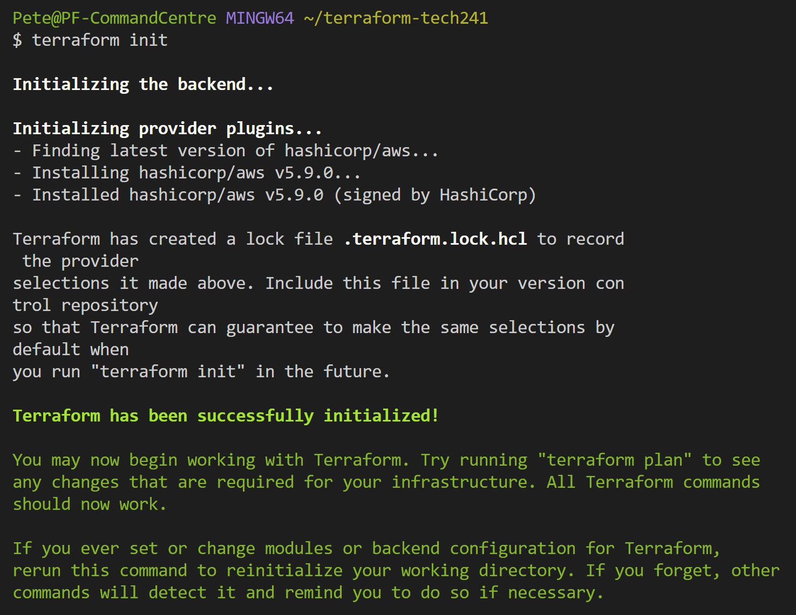
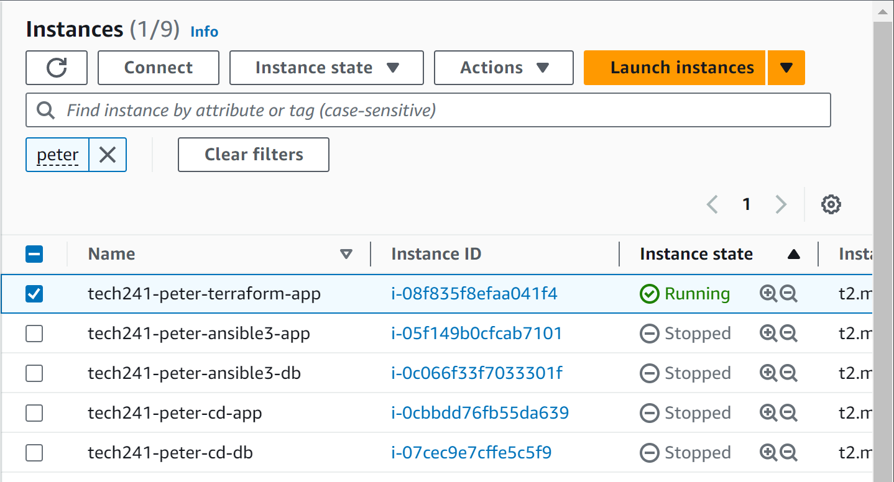
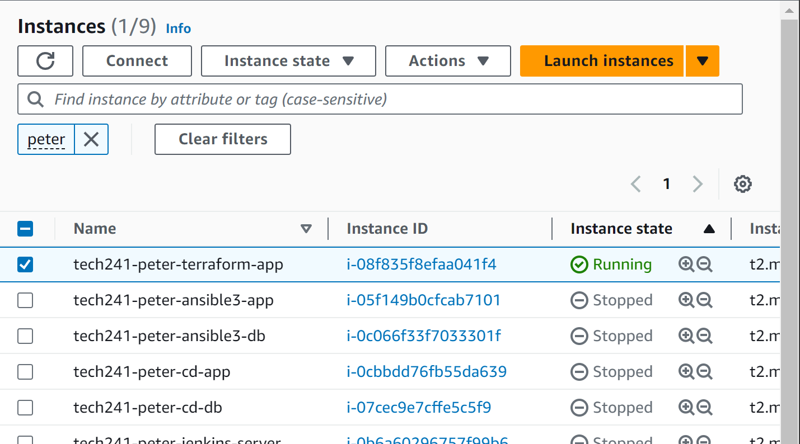
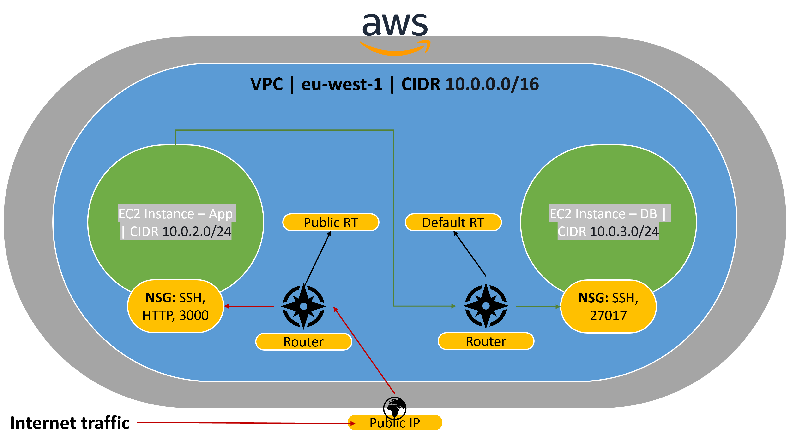

# Terraform


## Orchestration with Terraform

## Overview

Documentation from Terraform: https://registry.terraform.io/providers/hashicorp/aws/latest/docs.  
Also goodle "terraform documentation" to get the general docs too.

### What is Terraform?

An IaC tool that lets you define your cloud resources (and on-prem) in human readable code.


### Why use Terraform?

You can use a consistent workflow to provision, manage, and track infrastructure throughout its lifecycle.

You can use it to automate changes to your infrastructure. Terraform abstracts the underlying logic of creating resources, so you are writing the config files in a way that describes how you want your infrastructure's end state to be.

You can submit your Terraform config files to a VCS (GitHub) and use Terraform Cloud to manage Terraform workflows across teams. This means that your team can all collaborate on Terraform.

### Benefits?

**Cloud Independent.** Terraform can talk to all cloud providers. Allows you to use the same tools and processes regardless of what cloud provider you are using. Write scripts only once and reuse them in different clouds. Save a business time and money.

**Reusability.** Infrastructure can be defined in a modular way, which can then be used again in a new deployment. Helps to reduce duplication and manage infrastructure at scale.

**Version History.** This is automatically maintained and allows for rollbacks if mistakes or errors occur. Allows for quick failure/disaster recovery.

**Collaborative**. As mentioned, Terraform can be used collaboratively using version control.

**Consistent.** Terraform's use of high level config language means you specify with consistency and predictability.

### Who is using it?

**Almost every Sparta client uses Terraform. Most of the largest companies in the world also use it.**

Reportedly, at least 1941 companies use it, including:

* Uber.
* Udemy.
* Instacart.
* LaunchDarkly.
* Slack.
* Robinhood.
* Twitch.
* Delivery Hero.

## Setting up Terraform

1. Download the terraform.exe from the Terraform website
2. Extract it into c://terraform (make new folder)
3. Search for "env" in task bar.
4. Click on "path" and edit, then paste the file path of the terraform directory into the field.
5. Restart any open terminals
6. type `terraform --version`. If you get command not found, you did it wrong. It will return the version if you did it right.

## Terraform with AWS

Dependencies:
* AWS Account with correct permissions
* IAM roles
* Either:
  * Pem file
  * AWS access/secret keys (can do it with just pem file)  
**Do not** use the same key/authentication method for everything. Use a different method for orchestration and a different one for config management.

Terraform config file uses `.tf` extension

We run terraform scripts on our local machines, but are targeting the cloud.

On our local machine, we need to:
* Create env var
  * AWS_ACCESS_KEY_ID: *key*
  * AWS_SECRET_KEY_ID: *key*

**Restart any open shells/terminals after creating new env var.** They won't recognise them as having being created otherwise. If you get errors with them, just **delete and recreate them**.


This info is **encapsulated**, we hide this from everyone else as it is super confidential info.

### Launching EC2 with Terraform

**Benefit:** Terraform takes much fewer lines of code to launch an ec2 compared to Ansible. 

1. Create directory in home folder on local (terraform-tech241) [`mkdir terraform-tech241`]
2. navigate into the created directory [`cd terraform-tech241`]
3. create a new file called `main.tf`
4. Open `main.tf` in nano [`nano main.tf`]
5. Enter information about the cloud provider you want to launch on.
```
# provider name
provider "aws"{
        # where in aws?-  region
        region = "eu-west-1"
}
```
6. Save and close, then run `terraform init`  
   If everything has been configured successfully so far it will return this:  
   
7. nano back into `main.tf`
8. Enter the details for the resource you want to launch:
```
   # launch an ec2 in the specified region (Ireland)
resource "aws_instance" "app_instance"{

        # which machine/OS version etc. AMI-id (ubuntu 18.04LTS)
        ami = "ami-0943382e114f188e8"
        # what type of instance (t2 micro)
        instance_type = "t2.micro"
        # is the public IP required?
        associate_public_ip_address = true
        # What should the name be? (tech241-peter-terraform-app)
        tags = {
             Name= "tech241-peter-terraform-app"
        }

}
```
9. Save and close, then run `terraform plan`
10. If code configured properly, it will ask you to input "yes" to continue. It will then return information about what it will do once you actually run it.
11. To launch the ec2, use command `terraform apply` and input yes when prompted. It will return the information about what it has created.
12. Check on AWS EC2 Instances dashboard to see it working!


13. To remove the ec2, use command `terraform destroy`. This will terminate your instance and, again, requires you to input "yes".
---
## Setting up a VPC on AWS with Terraform




**APP:**
* Ingress:
  * SSH, TCP, 22, 0.0.0.0/0
  * HTTP, TCP, 80, 0.0.0.0/0
  * Custom, TCP, 3000, 0.0.0.0/0
* Egress
  * All Traffic, all, all, 0.0.0.0/0
* Availability Zone: eu-west-1a

**DB:**
* Ingress:
  * SSH, TCP, 22, 0.0.0.0/0
  * Custom, TCP, 27017, 0.0.0.0/0
* Egress:
  * All Traffic, all, all, 0.0.0.0/0
* Availability Zone: eu-west-1b

**Steps:**  
In a .tf file:

1. Provider
   1. region
2. Create and Name VPC
   1. cidr block
   2. tag name
3. Create and Name Public Subnet
   1. vpc id
   2. cidr block
   3. availability zone
   4. tag name
4. Repeat above step for Private Subnet
5. Create and Name IGW
   1. vpc id
6. Create and Name Public Route Table
   1. vpc id
   2. route
      1. cidr block
      2. gateway id
7. Create and Name Public Route Table Association
   1. subnet id
   2. route table id
8. Create and Name Public Subnet SG
   1. name prefix
   2. ingress (inbound port rules)
   3. vpc id
9. Repeat above step for Private Subnet SG
10. Create and Name EC2 Instance in Public Subnet
    1.  ami
    2.  instance type
    3.  associate public ip address
    4.  subnet id
    5.  vpc security grup ids
    6.  tags

## Variables

You can store some values as variables in a `variable.tf`, then you can call them when needed. This can save you a lot of time. It also means you can abstract sensitive info like ami id into a file which will be kept private. Make sure to **add the variable file and other config/important files into .gitignore** so that confidential information doesn't get leaked.

Write the script as above first, and then you can go down and create variables and replace the values with their var names.

We can go a level further and automate the values of our variables instead of hard code. If we assign a variable from the tfstate file (terraform updates this information)


## Setting up all AWS Services with Terraform

https://trello.com/c/Q7Fi99tM

