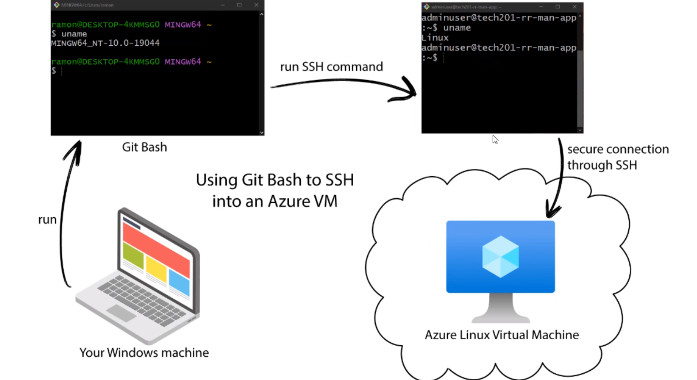
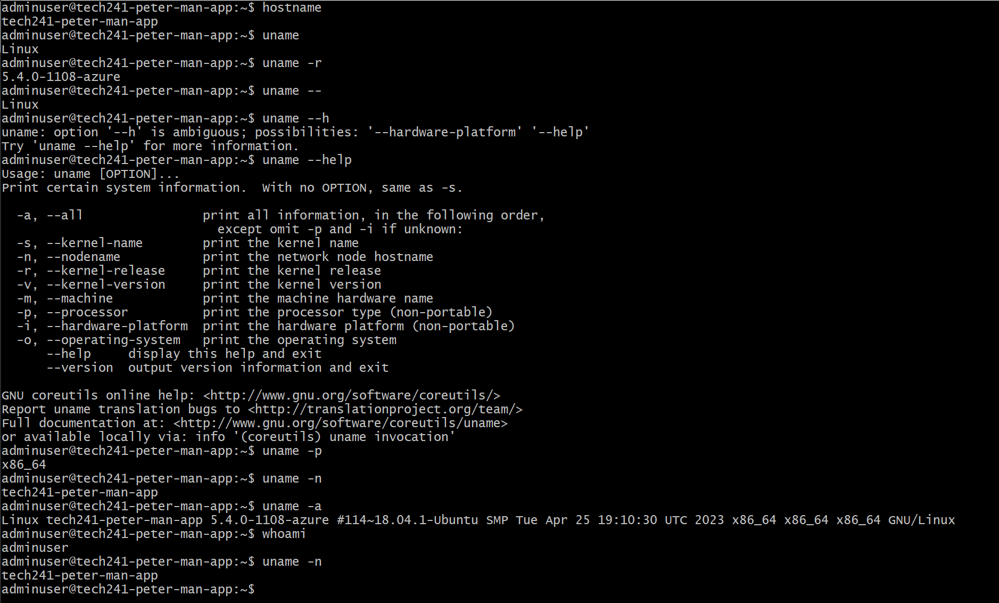
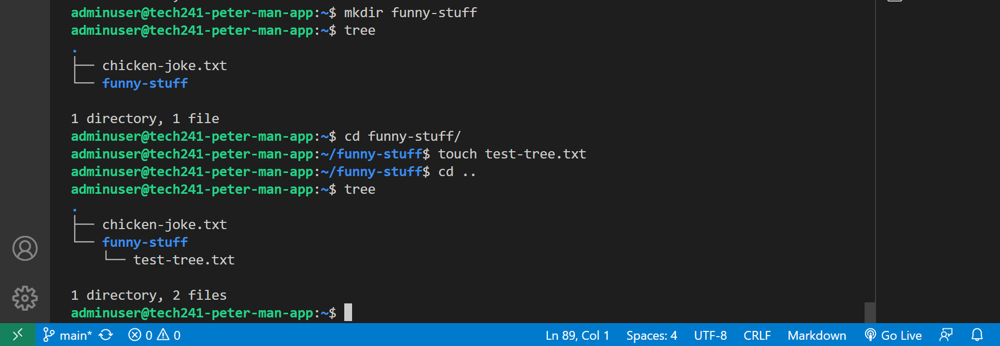

# Linux Notes

---

## Why Linux?

Robust, reliable, stable, scalable, used in DevOps, wil make us more employable if we have an understanding.

Linux consists of a kernel. There are many distributions of Linux. We are using Ubuntu for the course.

---

### BASH

Bourne Again SHell

Improved version of the shell that was used before with Unix. Unix was a command-driven OS. It has changed to Linux now, which also has a shell.

*A shell is a software that provides an interface to run commands*

/bin/bash

(you can change to a different shell)(you can check what shell and processors are running with the ps command)

---

## Shell command tricks

history (show history of commands)

!*number*(runs command at that num in the history)
-c clears history

**for assessment**
NOT as important:

head, 
tail, 
nl, 
cat /etc/shells, 
ps -p $$, 
unset, 

---

## Navigating files and folders
ls (lists files and folders in current directory)

Linux treats everything like a file, even folders. a dot ( . ) represents a current directory.

two dots (  .. ) represents parent directory.

everything in linux starts at the root folder (/)

The home folder is the user folder, not the actual home. /home/**adminuser**

Make sure you understand how to get to your home directory/folder and also how to get to the root directory.folder. **fundamental knowledge**!

rename file: 
```
mv cat.jpg cat.txt
```

copy file:
```
cp cat.txt cat.jpg
```
move file:
```
mv
```
(remember: . is current directory, .. is parent. Helpful for typing less when specifying the location of a flie to move/location to move it to)

~ takes you to the home dir too!

remove file: 
```
rm cat.txt #(note: be careful with remove!)
```
you can make multiple directories at once with spaces (this is why we use underscores or hyphons in file names)

rm -r to remove a folder (again, BE CAREFUL! THIS WILL REMOVE EVERYTHING IN THE FOLDER!!!)

linux cares about file extensions!

linux is case sensitive!

---

## working with files

```
touch chicken-joke.txt
nano chicken-joke.txt
```
nano command opens nano text editor.
ctrl S to save, ctrl X to exit
```
cat chicken-joke.txt
```
cat command concatenates the specified file. Effectively prints the file in the BASH terminal.

Head command prints specified number of lines from the start of a specified file:
```
adminuser@tech241-peter-man-app:~/funny-stuff$ head -2 chicken-joke.txt

    Question:

    Why did the chicken cross the road?
```
Tail command does the same but from the end of the file.
```
adminuser@tech241-peter-man-app:~/ funny-stuff$ tail -2 chicken-joke.txt

    Answer:

    It missed it's eggsit!
```

nl command for getting lines too.


(to get back to windows in BASH, **exit** out of your VM first)


git bash commands work in windows because we have installed it and it emulates the linux environment.



---
cat chicken-joke.txt | **grep** chicken

The grep command searches within files.



cd / takes you to the root directory

cd takes you back to your home folder.

The home folder is a folder within the home folder.

-y on the end of a command auto answers YES if there is a Y/N option during the run of the command.

---

## Running a bash script

setting up nginx

```
touch provision.sh
```
we have rw permissions, no need to use sudo

(sudo = run command as superuser)
```
nano provision.sh
```
start with a shebang 
```
#!
```

Important for devops: **plan out the steps first!!!**

* Update
* Upgrade (situational, be careful with what you install! Might not want to upgrade everything.)
* install nginx
* restart nginx
* enable nginx (make sure that nginx automatically starts after reboot)

You can open a second git bash to test your scripts.
**WE DO EVERYTHING MANUALLY FIRST BEFORE WE AUTOMATE**

TO run a file in Linux, you have to provide a path to the file first (if it doesn't already know the path)

```
./scriptfilename
```
^ to run (when in same directory, can do ~/filepath/scriptfilename from anywhere)

---
## Environment Variables

If we need a value stored in memory in Linux, we can use these to do that.
* Value stored memory
* Accessible by other tools in Linux

printenv to see

**Linux is case sensitive!**

Example: prinvenv USER          *print the user*

(echo is a really easy way to print something to the terminal screen)

MYNAME=peter *This is how you can store a variable, but it is not an ENVIRONMENT variable*

Create environment variable:

    export MYNAME=peter
Check it worked: printenv and look through list OR printenv MYNAME and it will be displayed.

Tip: use grep command to help you find it in the list!

use unset to clear an env var, useful for if you make typos too - just enter it again!

---

**How to make an environment variable persistent**

If you set an env var, and then you log off and on again, the variables will be gone. You can change this by making an env var persistent.

we need to edit a file called .bashrc (**DONT MESS THIS FILE UP, IT IS A SYSTEM FILE)

add export VARNAME=value to .bashrc in nano

then export VARNAME=value as before.

Check by exiting and reconnecting SSH

This is how to set up persistent env var for our user only (adminuser in this case)

Rememeber: Variable = Env Var is about SCOPE. Env Vars are global for that VM and can be made persistent, normal variables are only accessible where they are declared and stored.

---

## Processes

Two types of processes in Linux:

System processes (ps aux(See all, not just system processes))

User processes (**ps**)

Every process has a process ID (PID). Every process has to be started by something. 

ps aux (using a u and x simultaneously)


### Starting and killing processes

sleep 3 (foreground to sleep for number of seconds)
sleep 5000 **&** (ampersand tells it to run in the background)
jobs
lobs -l (shows us the process id)

64 levels of killing a process

kill -1 process id = hangup

kill process id = terminated (NB, this is techincally -15 but you don't need to use a number for it), this also kills any child processes under the parent process.

**kill -9** process id = (brute force kill, harshest of all of them). A brute force kill does not kill child processes, and they become zombie processes.j

Killing is very useful for if you are running an app during testing/dev and you want to run it again. You will most likely use brute force kill for this scenario.

### Controlling system processes

systemctl is the command for controlling system processes.

sudo systemctl stop nginx, for example.