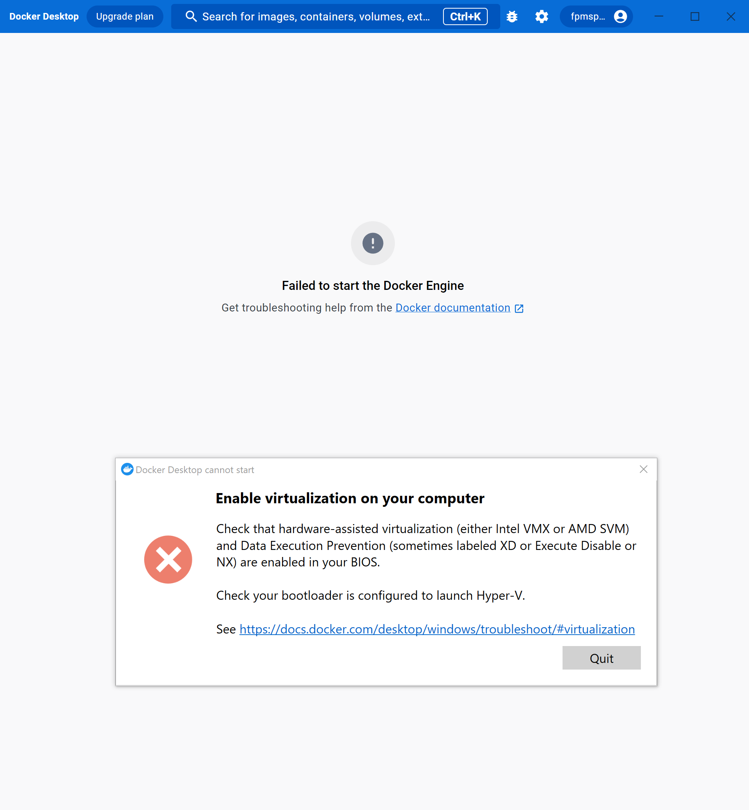
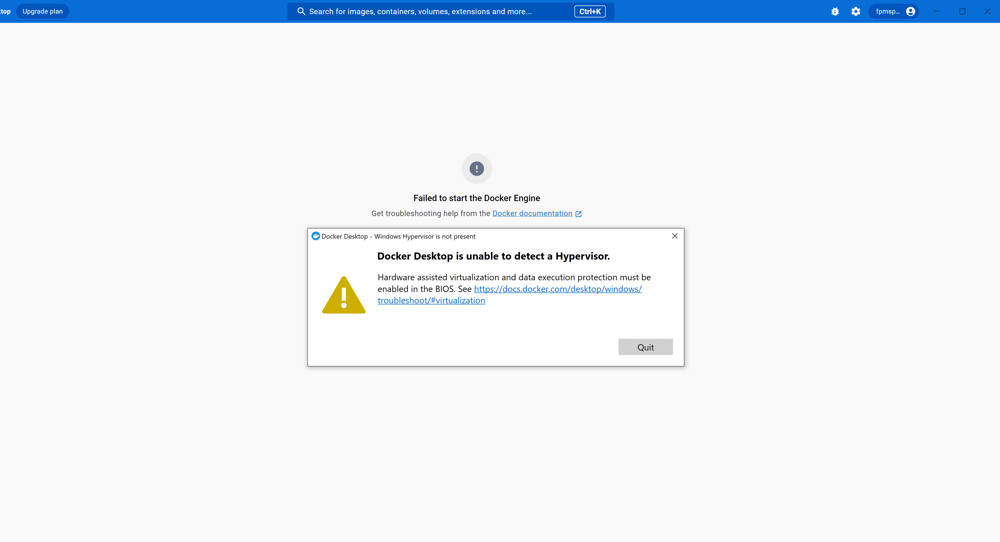
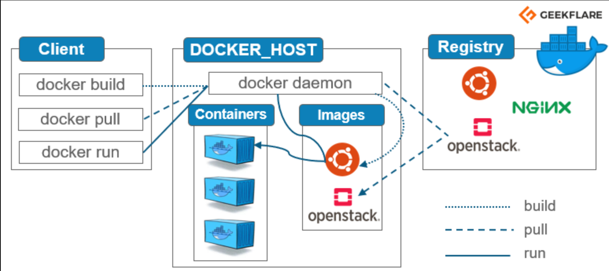

# Containerisation with Docker

## Prologue: Installation

Download here: https://docs.docker.com/desktop/install/windows-install/

Run the exe file

leave the default settings ticked (you can opt to not have a desktop shortcut though)

Restart computer

Create account.

Simples.

**BUT WAIT!**

If Docker throws you one of these:

You need to check the following:

1. search **turn windows features on or off** and check every box under **hyper -v** is enabled
2. check task manager>performance>cpu. If virtualization is DISABLED, you need to enable it.
3. open cmd as admin and run `bcdedit /set hypervisorlaunchtype auto` to make virtualisation enabled on startup
4. If none of this works, restart machine and launch BIOS. Enable virtualisation and make sure you properly save/load that setting. Find out what name/version of bios you have and google how to enable virtualisation in it.
5. I also had to update my WSL version.

---
## Containerisation and Docker Overview

Docker Client = Us, our local machine. Docker users can interact with Docker through a client. When any docker commands runs, the client sends them to dockerd daemon, which carries them out. Docker API is used by Docker commands.   
Docker Host = Docker engine, the desktop app we installed shows it. Becomes available when we install docker.  
Containers = Like an EC2. Can have as many as we want. Can be different types. Containers run like VMs, IP address etc. We can't create these directly. We make them using...  
Images = like AMI. Immutable, so you have to rebuild your own version if you want to make changes.  
Registry

Docker USP: Integration. Works on windows, mac, and linux.

---
## Docker commands

`docker --version`  
`docker images` to check what images you have on your docker client/local.  
`docker run hello-world` runs an image, in this case the hello-world image.  
`docker ps` shows containers that are running.  
`docker ps -a` shows both running and stopped containers.  
`docker run -d -p 80:80 nginx`  
* run container
* in detached mode (background process, does not engage the terminal. Think pm2 for nodejs apps.)
* port 80 on host is mapped to port 80 on the container. Essential for accessing the container. In this case 80 = http port.
* name the docker image you want to use to make the container, in this case the official nginx image from dockerhub. Pulls this image and makes new container based on it.  
`docker stop imageid` stops a container.  
`docker start imageid` starts a container.  
`docker exec -it 8eb07c071479 sh` execute a container in interactive mode using shell (like logging into it)

docker commit

docker push

**Delete Containers:**

`docker rm containerID`. If container ID is valid (exists), it gets deleted. If not, it gets an error to stop the cont.

## Using a script to host customised index.html using nginx web server

* index.html must be available in our localhost
* Dockerfile
  * include whatever we want to run in this.
  * copy into /usr/share/nginx/html/
  * docker build using using that file

`docker build -t fpmspartan/tech241-nginx .`  
`docker run -d -p 99:80 image-name`  

nb: for convenience, provide index.html in the same location as the Dockerfile, otherwise you will need to specify its file path in the COPY command

## Containerising the Sparta App

**NOTE:** You build the **image**, then you run the **image**, then the container ID shows up in `docker ps`

Make your Dockerfile inside the app folder.

Start from the official **node** image on Dockerhub (v 12 because the sparta app needs that as a dependency).

Install pm2.  
Copy the app folder file across into /app.  
Set the working directory to /app.  
Run npm install.  
Expose port 3000.  
Run `node app.js`.  

Build the image. Run container using that image. Push to dockerhub. Simples.

## Containerising the db for the sparta app

1. Pull the official mongo image
2. Build a container from it
3. In Docker Desktop, find the container, go to file.etc/mongod.conf.orig, and change the bindIP and save