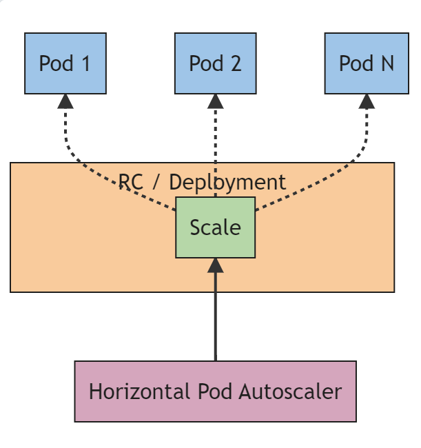
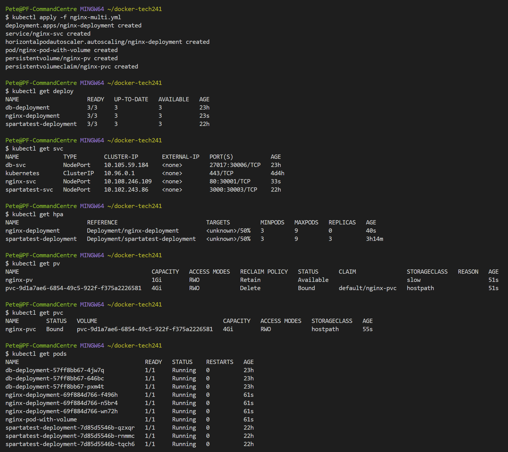

# Orchestration with Kubernetes (K8)

## Installing Kubernetes

Docker Desktop > Settings > Kubernetes > Tick "Enable Kubernetes and "Show system containers" > Click "Apply and restart".

## Overview

### What is Kubernetes
K8 is a platform for managing containerised microservices.  
You can use it for configuration and automation.  
Kubernetes is the tool that orchestrates the infrastructure to handle changes in workflow.  
Kubernetes is the fastest growing project in the history of open-source software, after Linux. 

K8 architecture Diagram
![K8 Architecture Diagram]](images/k8-architecture.png)

Cluster: A system deployed on Kubernetes.  
Control plane: brain of the operation.  
Nodes: the machines that do the work. K8 adds more to auto scale as needed.   


### Why Use Kubernetes?
1. **Self Healing.** self-healing capabilities automatically restart failed containers and replace unresponsive nodes, enhancing application reliability and uptime, critical for seamless user experiences.
2. Kubernetes' robust scheduling capabilities optimize resource utilization, ensuring applications run efficiently, reducing infrastructure costs, and facilitating horizontal scaling to meet varying demands.
3. Automates operation tasks of container management. Made for high availability and scalability.

A Container is a **single point of failure**. K8 makes containers **highly available and scalable**.

### Business Benefits

1. The increasingly widespread use of Kubernetes among DevOps teams means businesses have a lower learning curve when starting with the container orchestration platform.
2. Kubernetes helps companies save on ecosystem management and automate manual processes by efficiently provisioning containers into nodes, resulting in lower costs and improved workflow efficiency.
3. Kubernetes enhances DevOps efficiency for microservices architecture through simplified development, testing, and deployment, enabling smaller development teams and better IT operational efficiency.
4. Kubernetes facilitates deploying workloads in multicloud environments, allowing easy migration of containerized applications across cloud providers without vendor lock-in.
5. Kubernetes provides greater portability and less chance of vendor lock-in by using lightweight containers that run on various types of infrastructure and container runtimes
6. Kubernetes automates deployment and scalability, allowing teams to scale up or down based on demand and achieve application stability and availability.
7. Kubernetes ensures app stability and availability in cloud environments through automatic workload placement, balancing, and self-healing capabilities, even during node failures.
8. Kubernetes' open-source nature offers a vast ecosystem of tools, continuous innovation, and portability across major cloud providers, protecting investments and avoiding technology obsolescence.

### Challenges

The major challenges on Kubernetes revolve around the dynamic architecture of the platform. Containers keep getting created and destroyed based on the developers' load and specifications. With many moving parts in terms of concepts, subsystems, processes, machines and code, Kubernetes is prone to mistakes.

### What businesses are using K8?

1. Booking.com

Challenge: Booking.com faced knowledge bottlenecks when using OpenShift, with the infrastructure team becoming a bottleneck due to abstracted Kubernetes.

Solution: To overcome the challenge, they built their own vanilla Kubernetes platform and encouraged developers to learn Kubernetes.

Impact: Despite the learning curve, adoption of the new Kubernetes platform led to significant time savings, reducing service creation time from days to minutes, resulting in the creation of 500 new services in the first 8 months.

2. Adidas

Challenge: adidas faced delays in accessing software tools, with a time-consuming process for getting a developer VM.

Solution: They implemented containerization, agile development, continuous delivery, and a cloud-native platform with Kubernetes and Prometheus to shorten the project setup time.

Impact: Within six months, 100% of the adidas e-commerce site ran on Kubernetes, reducing load time by half and increasing release frequency. Now, 40% of critical systems run on their cloud-native platform.

### K8 Objects

1. Pods: Smallest deployable units, containing one or more containers.
2. Deployments: Manage pod replicas, enable updates, and scaling.
3. Services: Provide stable network endpoints for communication between pods.
4. Replica Sets: Ensure a specified number of pod replicas are running. **Eliminate single point of failure of containers, and make them highly available and scalable.**
5. Labels: Key-value pairs for adding metadata to Kubernetes objects.
6. Selectors: Criteria used to group resources based on their labels.

## Using K8

In terminal:

`kubectl get service` will return something like this:  
`kubernetes   ClusterIP   10.96.0.1    <none>        443/TCP   85m`. This is how you know it's working. If it throws up an error, you might want to check if you have any containers running and using up ports, and stop them. If not that, then make sure to restart your K8 Cluster

### K8 Deployment

`kubectl create -f file-name.yml` (-f = filename)

**Dependencies:**  
K8 deployment node_k8.yml  
K8 Cluster  
Docker running  
Docker image (production-ready)  
mongodb custom image 

**Connecting app with db:**  
K8 services to expose deployment  
K8 labels and selectors

## Deploying the Sparta App using K8

### 1. Deploy the app
1. create spartatest-k8.yml
2. specify that it is a Deployment file
3. make sure you use the node label to group everything together
4. Use the docker image for the spartatest app that we made
5. specify port 3000 for the containerPort so that we can connect our service to it next.

```yml
---
apiVersion: apps/v1
kind: Deployment

metadata:
  name: spartatest-deployment
spec:
  selector:
    matchLabels:
      app: node

  replicas: 3

  template:
    metadata:
      labels:
        app: node

    spec:
      containers:
      - name: node
        image: fpmspartan/tech241-spartatest:v4
        ports:
        - containerPort: 3000
```

### 2. Create service for the app
1. create file spartatest-service.yml
2. specify that it is a Service file
3. use node label to group it with the app deployment
4. specify port 3000 for port and targetPort so that it connects to the container correctly.

```yml
---
apiVersion: v1
kind: Service
metadata:
  name: spartatest-svc
  namespace: default
spec:
  ports:
  - nodePort: 30003
    port: 3000
    targetPort: 3000
  selector:
    app: node
  type: NodePort
```

### 3. Deploy the db

Follow the steps to create the dm image with docker first.
1. create file db-k8.yml
```yml
apiVersion: apps/v1
kind: Deployment

metadata:
  name: db-deployment
spec:
  selector:
    matchLabels:
      app: mongo

  replicas: 3

  template:
    metadata:
      labels:
        app: mongo

    spec:
      containers:
      - name: mongo
        image: fpmspartan/tech241-mongodb:v69
        ports:
        - containerPort: 27017
```
2. Create the file db-service.yml
```yml
---
# Select type of API version and type of service/object
apiVersion: v1
kind: Service
# metadata for name
metadata:
  name: db-svc
  namespace: default # sre, you can have two files with the same name as long as they are not in the same folder/are in different folders
# specification to include port selector to connect to the deployment
spec:
  ports:
  - nodePort: 30006 # range is 30000 - 32768
    port: 27017
    targetPort: 27017

# define the selector and label to connect to ngins deployment
  selector:
    app: mongo # this lavel connects this service to deployment
# Create nodePort type of deployment
  type: NodePort # also use LoadBalancer - for local use cluster IP
```

`kubectl create -f` both files.

### 4. Connecting the db and app

in the spartatest-k8.yml file:
1. add the following (indentation matches name, image, and ports above it.): 
```yml
        env:
        - name: DB_HOST
          value: mongodb://db-svc:27017/posts  
```
2. You must run the db deployment and service first otherwise it will not work.
3. Once the db stuff is running, run the spartatest deployment and service.
4. Go to localhost:30006/posts (or whatever port you specified for the nodePort in spartatest service)
5. If you can't see the posts, you need to seed the db. Get the name of one of the pods from the spartatest deployment and run: `kubectl exec pod-name env node seeds/seed.js`

### Quick summary of the steps for deploying the sparta app with posts page:

1.	Containerise sparta app
    a. Create dockerfile inside the app folder
    b.	Use official image for node 12
    c.	Install pm2 so the app can run in the background
    d.	Use copy command so the app files are copied over during the build
    e.	npm Install, Expose port 3000and start the app
2.	Containerise database
    a.	Create container with official mongo image
    b.	Docker desktop. Find container
    c.	Files>etc>mongod.conf.orig.
    d.	Edit bindIP and save.
3.	Set up db deployment and service
    a. remember port 27017
4.	Set up sparta app deployment and service
    a. remember port 3000
5.	Go to localhost:nodePort/posts (nodePort specified in spartatest deployment file.)

---
## Autoscaling with K8

### A note about editing
`kubectl edit deploy deployment-name` to edit a deployment while it is still running. Nobody else can make a change while you are editing. This has the benefit of the site not going down while you make changes. Eg: Amazon processes 50,000 transactions per second. So even if you only took the site down for 10 seconds, you would cost amazon half a million transactions.

**Blocker:** running the above command returns `error: unable to launch the editor "notepad"`.  
**Solution:** Create an environment variable on your machine called `KUBE_EDITOR` and set the value to whatever editor you want to use. For vs code, this is `code -w` with the -w watch flag so that K8 knows when you have saved changes.

### Adding resources to a deployment
In the deployment yml file, we can allocate resources from our local machine, such as memory and cpu.  

**Limits:** The "limits" define the maximum amount of resources that a container is allowed to consume. These resource limits help prevent a single container from using an excessive amount of resources and potentially impacting other containers or services running on the same node. When a container reaches its resource limits, Kubernetes will take action, such as throttling or restarting the container, to protect the overall stability and performance of the cluster.

For example, if you set CPU and memory limits for a container, it will not be allowed to consume more CPU and memory than specified. If the container tries to exceed its limits, Kubernetes will intervene and apply resource management measures to mitigate the impact on other containers and the node itself.

**Requests:** The "requests" represent the minimum amount of resources that a container needs to run properly. When you define resource requests for a container, you are effectively reserving those resources on the node where the pod is scheduled. The Kubernetes scheduler takes these resource requests into account when deciding where to place the pod. If the node does not have enough available resources to satisfy the requested amount, the pod will not be scheduled on that node.

For example, setting CPU and memory requests for a container allows Kubernetes to ensure that a suitable node with enough CPU and memory capacity is selected to run the pod. If a container's CPU request is 0.5 CPU units and its memory request is 512 MiB, the scheduler will find a node with at least 0.5 CPU units and 512 MiB of available memory before scheduling the pod. 

**Requests:** The minimum amount of resources that a container needs to run. Used for scheduling and ensuring the container gets the necessary resources.  
**Limits:** The maximum amount of resources that a container is allowed to consume. Used for resource protection and preventing containers from monopolizing resources.

You can use **Docker Desktop** to see the size of your containers and other specs, which you can then use to determine the requests and limits for your deployment of that container.

Use limits and requests in conjunction with monitoring so that if your pod is approaching the limit, you can be alerted to it and take action.

Example:  
```yml
        resources:
          requests:
            memory: "50Mi"
            cpu: "500m"
          limits:  
            memory: "500Mi"
            cpu: "2000m"
```

### Horizontal Pod Autoscaling



HPA is used to autoscale based on demand/traffic. Similar to how we specify min and max number of EC2 instances on AWS ASG, we specify the min and max number of replicas that can be running at once. We also specify the target CPU Utilisation percentage.

The HPA will try to maintain the average CPU utilization of the target pods to the specified percentage. If the CPU utilization exceeds this percentage, it will scale up the number of replicas (up to the maximum )until the utilization is brought down. If it falls below this percentage, it will scale down the replicas (down to the minimum).

Below is an example of how we would create HPA for our sparta test app:

```yml
---
apiVersion: autoscaling/v1
kind: HorizontalPodAutoscaler
metadata:
  name: spartatest-deployment
  namespace: default
spec:
  scaleTargetRef:
    apiVersion: apps/v1
    kind: Deployment
    name: spartatest-deployment
  minReplicas: 3
  maxReplicas: 9
  targetCPUUtilizationPercentage: 50
  

```

### Volume

Three types of volume in K8:
* volume
* persistent volume
* persistent volume claim

A volume in Kubernetes is an abstracted storage unit that can be mounted into one or more containers within a pod. It provides a way to share data between containers or to persist data beyond the lifecycle of a single container. Volumes are independent of the container's lifecycle and are attached to pods rather than individual containers. When a pod is deleted, the data in the volume can persist if the underlying storage supports it.

Volumes are defined within the spec section of the pod manifest. There are various types of volumes available in Kubernetes, such as emptyDir (ephemeral), hostPath (mounts a file or directory from the host), ConfigMap, Secret, etc.

Example of how to create a volume:

```yml
apiVersion: v1
kind: Pod
metadata:
  name: my-pod
spec:
  containers:
    - name: existing-container-name # Use the name of an existing container here
      image: image-name:tag
      volumeMounts:
        - name: my-volume
          mountPath: /data # The path where the emptyDir volume will be mounted inside the container
  volumes:
    - name: my-volume # must match name in volumeMounts
      emptyDir: {}
```

### Persistent Volume (PV):
A persistent volume (PV) is a cluster-wide storage resource in Kubernetes that exists independently of any pod. It is a way to represent and manage physical or networked storage resources in the cluster. A PV is provisioned by the cluster administrator and can be dynamically provisioned or pre-provisioned. PVs have a lifecycle independent of pods, and they persist data even if the pods using them are deleted.

Persistent volumes are defined using the PersistentVolume API object in Kubernetes. They represent the actual physical storage resources, such as a network-attached storage (NAS) system, a cloud-based storage service, or an on-premises storage solution.

Example of creating a persistent volume:

```yml
apiVersion: v1
kind: PersistentVolume
metadata:
  name: my-pv
spec:
  capacity:
    storage: 5Gi # Specify the storage capacity you need
  volumeMode: Filesystem # The volume mode, either "Filesystem" or "Block" (if supported by the underlying storage)
  accessModes:
    - ReadWriteOnce # Specify the access mode(s) needed (e.g., ReadWriteOnce, ReadOnlyMany, ReadWriteMany)
  persistentVolumeReclaimPolicy: Retain # Specify the reclaim policy (e.g., Retain, Recycle, Delete)
  storageClassName: slow # Optionally specify the storage class name to be used by the PersistentVolumeClaim (PVC)
  # Additional configuration options specific to the underlying storage (if required)
```

### Persistent Volume Claim (PVC):
A persistent volume claim (PVC) is a request for storage by a user or a pod. It is a way for pods to request a specific amount of storage and access modes without knowing the details of the underlying storage. PVCs provide a level of abstraction between the pod and the PV, allowing the storage to be dynamically provisioned based on the requested properties.

When a pod needs storage, it creates a PVC with specific resource requirements (e.g., storage capacity and access mode). The cluster's storage system matches the request to an available PV that meets the criteria specified in the PVC. Once the PVC is bound to a PV, the pod can use it as a volume in the container.

A PersistentVolumeClaim (PVC) is a Kubernetes resource that allows a pod to request storage from a PersistentVolume (PV). PVCs provide a level of abstraction between the pod and the underlying storage, enabling dynamic provisioning and easier management of storage resources. Unlike "normal volumes" (emptyDir volumes), PVCs and PVs decouple storage from the lifecycle of the pod, allowing data persistence and easy sharing of storage across pods.

Example of a PVC:

```yml
apiVersion: v1
kind: PersistentVolumeClaim
metadata:
  name: my-pvc
spec:
  accessModes:
    - ReadWriteOnce # Specify the access mode(s) needed (e.g., ReadWriteOnce, ReadOnlyMany, ReadWriteMany)
  resources:
    requests:
      storage: 5Gi # Specify the storage capacity you need
  storageClassName: slow # Optionally specify the storage class name to be used for dynamic provisioning
  # Additional configuration options specific to the PVC (if required)
```
### Volume vs Persistent Volume

 Both types of volumes have their advantages and limitations, and the decision should be based on the characteristics and lifecycle needs of your application.

**Use Volume for:**

Temporary Data: emptyDir volumes are best suited for temporary data or caching needs within a single pod's lifecycle. They are tightly coupled to the pod and are created when the pod starts and deleted when the pod terminates. If you need data to be ephemeral and isolated to a single pod, emptyDir volumes are a good choice.

No Data Persistence Needed: If you do not require data persistence beyond the pod's lifecycle and data sharing between different pods, emptyDir volumes are sufficient. They provide fast and local storage without relying on external storage systems.

Easily Shared Data: EmptyDir volumes are useful for sharing data between containers within the same pod. Multiple containers within the pod can mount the same emptyDir volume, enabling communication and data sharing between them.

**Use PersistentVolume (PV) for:**

Data Persistence: If you need data to persist across pod restarts, rescheduling, or even when the original pod is deleted, you should use PVs. PVs are independent of the pod's lifecycle and retain data until explicitly released.

Data Sharing Across Pods: If multiple pods need access to the same data or you want to decouple data from the pod, PVs allow you to share storage resources across different pods. Multiple PVCs can claim the same PV.

Dynamic Provisioning: PVs support dynamic provisioning, where a storage class can automatically create PVs based on PVC requests. This allows for efficient utilization of storage resources without manual provisioning.
---
## Creating multiple k8 objects from a single file

We can combine all of our separate yml files into a single yml file. We have to use `---` as a separator between the code for each object.

Once we have the file, we have to run `kubectl apply -f file-name.yml` instead of *create*.

For this example, we create all the objects for our nginx deployment with one file:

1. deployment
2. service
3. horizontal pod autoscaler
4. pod with volume
5. persistent volume
6. persistent volume claim

If everything is configured correctly, here is what we should be able to see:



