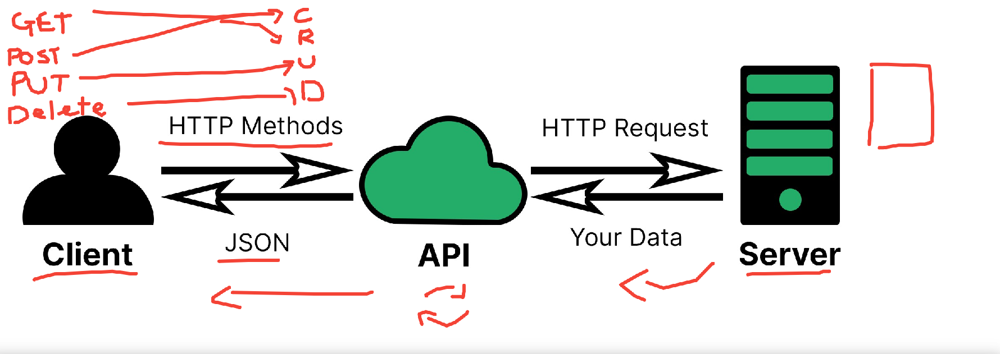
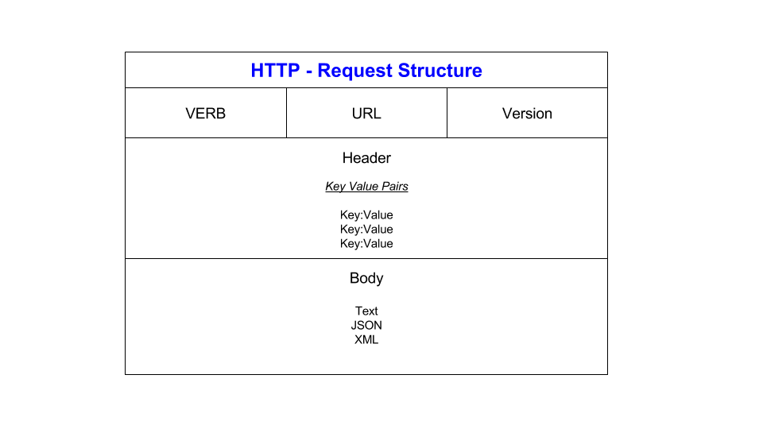
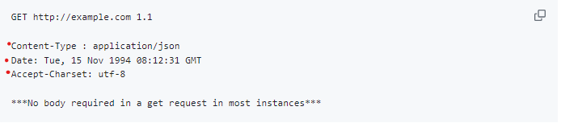
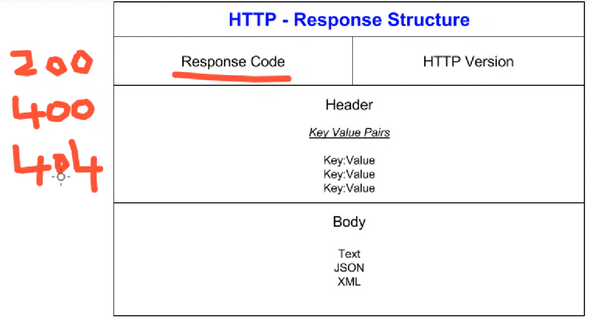
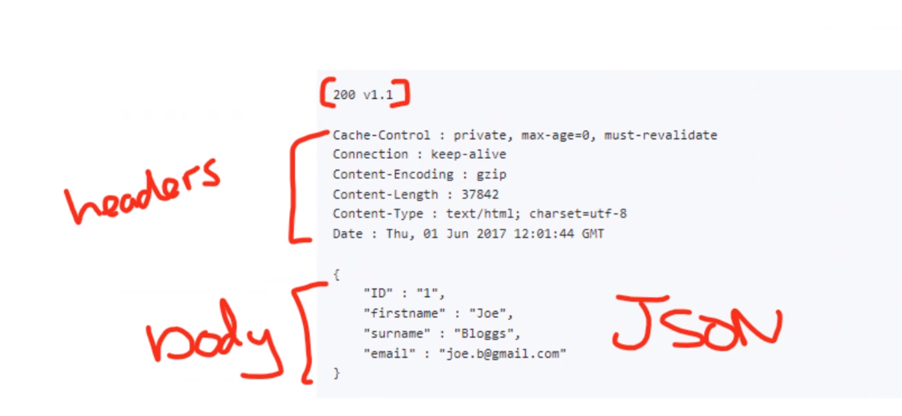

# API notes

Application Programming Interface

API is used to interact with other languages and systems.

Used a lot as a mediator between servers and clients.

HTTP methods:

Often called http verbs.

* Post -> Create  
* Get -> Read
* Put -> Update
* Delete -> Delete

* Patch -> Update

Get is the most common use for an API, involves just getting a look at data through the API without making any writes. Simple requests for info.

Post modifies underlying data, creating a new resource.

Put requests modify data, but they don't create new resources. They update an existing one.

Delete is... wait for it... Delete! Removes existing resource

HTTP Request structure:

### REST API

APIs have to be built by somebody. The way that they are built can influence how useful they are and their use cases.

REST APIs have been found to be good in DevOps context, we will be working with them a lot.

* Representational data flow
  * How is the data transferred from one point to the other. Client and server both need to be able to read the format. In REST, both client and server must be able to read the format. Representation needs to completely deliver the resource. When something is sent, all of it needs to go in one package. Don't want to send it in chunks, becomes more likely to not be sent in full. All or nothing.
  * Has to be documentation of resource contracts. If client doesn't know what it is expecting to receive, then it might not be able to consume it. API needs to give client a heads-up of how it is likely to receive the data, so client can prepare to receive
* URI's and naming.
  * URI = Uniform Resource Indicator, not Uniform Resource Link.
  * In REST API, properly naming resources is super important
*  **Statelessness!!**
  * API doesn't hold onto the status of a previous request. Every request is a new one, and APi has to handle it as such.
  * in a stateful service, only one request can be processed at a time.
  * in a restful api, requests can be run independently of each other.
* MUST support caching.
  * instead of going to the server every time, the API will look to see if it has processed any of the data requested previously, this is in the cache. This is useful for speed.

Some APIs are open source. Others are hidden behind a key (signup/register). IMDB API is free but you need to sign up and get the key from them.
Postcodes is an open API. Airbnb API.
Some APIs you have to pay for. EG the Reddit API fiasco.
Some APIs are completely private (government services)
Postman API. Makes API requests easier to mess around with.

IN short, there are different levels of API security.

### REST APIs will be on the test

* What are API’s? How are they used and why are they so popular?

 

* Add a diagram to showcase the data transfer process in API communication.

 

* What is a REST API? What makes an API RESTful?

 

* What is HTTP? (what does it stand for and what is it used for? What is HTTPS?)

 

* Explain HTTP request structure using the diagram provided.

 

* Explain HTTP response structure using the diagram provided.

 

* What are the 5 HTTP verbs and what do they do? GET, POST, PUT, PATCH, DELETE

 

* What is statelessness?

 

What is caching?