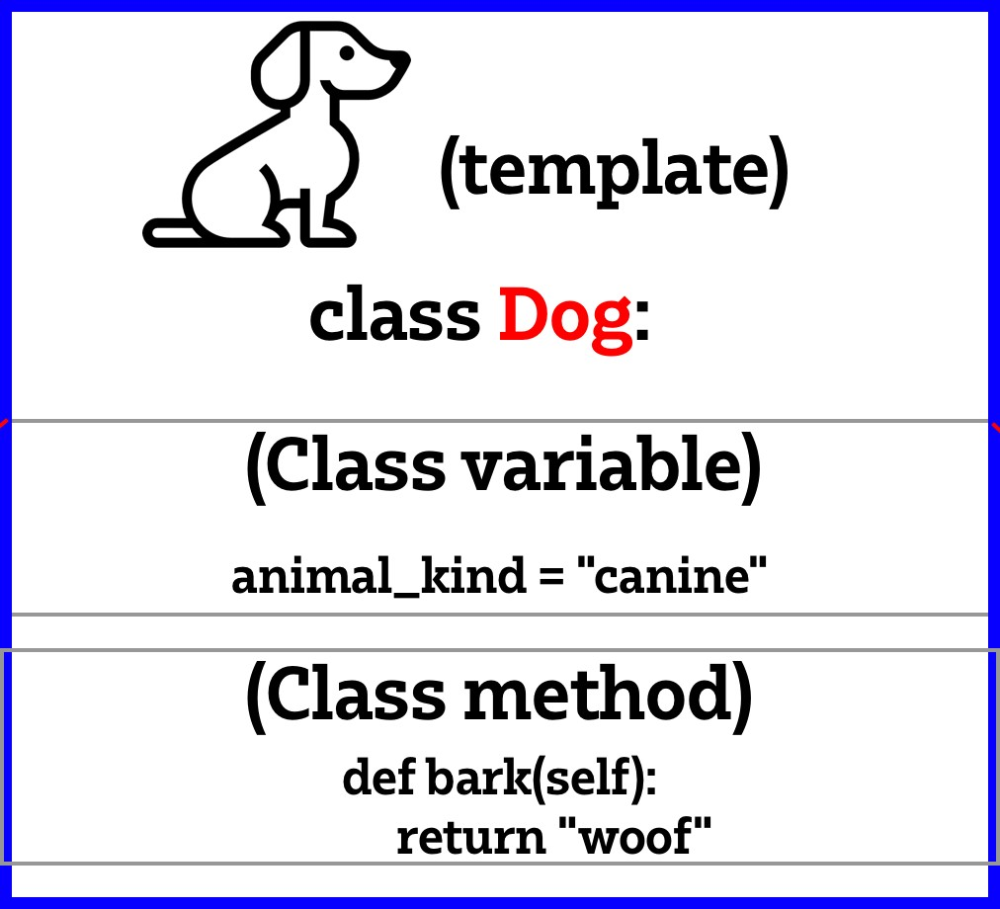

# Object Oriented Programming

Turning code into objects that can be manipulated.

Most of the time you don't need OOP for scripts, but more complex programs can need it.

Why learn OOP? - The HO wants us to know about it. Need to understand some of the code in their existing apps.

## Classes

Classes bring data and functionality together. Like bringing variables and code blocks into the same object. Good way of doing things but there are pitfalls.

You can write out the code normally and then refactor it into OOP.

Convention is to put a class into a separate file to make it more reusable.

When you create a class, the name of it SHOULD be capitalised.

Use CamelCase if your class name has more than one word.

self = referring to the current class. IN example, it's saying the dog is the one barking.



BE CAREFUL OF CLASS VARIABLES! Be mindful of the scope that you change class variables at because they can alter more than you expect.


## The 4 Pillars of OOP
1.  Abstraction - you don't always need to know how something works to use it. If you know how to drive, you don't need to know how the engine works.
2.  **Inheritance** - new classes can be created that are based on older classes. The new class takes (or inherits) variables and class methods from the parent/base class.
3.   Encapsulation - Who can access our classes and variables, and where.
4.   Polymorphism - Methods can have the same name, but act differently.

### Abstraction

Think of a car. What makes up a car? Engine, wheels, headlights, seats, etc. When we describe something in an abstract way (eg a car), many people would have a shared idea of what a car is and the operations we can do with it. For a car, you can start stop turn on lights etc.

A Class is a unit of abstraction. We need to specify properties, operations, and the name. An object is an instance of a class, and a class is a type of object.
```python
class Animal:

    def __init__(self):# init = when you make your class, all of these are true
        self.alive = True
        self.spine = True
        self.eyes = True
        self.lungs = True

    def breathe(self):
        print("One breath at a time, in and out")

    def eat(self):
        print("Nom Nom Nom")

    def procreate(self):
        print("Time to find a mate")

    def move(self):
        print("Onwards and upwards")

# breathe is abstracted. You don't need to know how breathe works in order to use it.

cat = Animal()
cat.breathe()
```

### Inheritance

car analogy: there are many types of cars: city cars, SUVs, luxury cars, sports cars etc.

We can create more specialised types based on the more general type. This works upwards too. Car is example of vehicle, so is bus, submarine, plane etc.

All those types of cars **inherit** features of a car.

Superclass > subclass

Base class > derived class


```python
from animal import Animal # Imports a class from another python file.import

class Reptile(Animal): # Adding Animal into the brackets tells python to use it as a template for the new class

    def __init__(self):
        super().__init__() # Initialises the parent/base class - inherit everything from Animal.
        self.cold_blooded = True
        self.tetrapod = None # not all reptiles have four legs
        self.heart_chambers = [3, 4] # reptiles can have 3 or 4 heart chambers
        self.amniotic_eggs = None # not True for all reptiles

    def seek_heat(self):
        print("it's chilly outside, I need a sunbed")

    def hunt(self):
        print("Hunting prey")

    def use_venom(self):
        print("If I have it, may as well use it")

    def attract_mate_through_scent(self):
        print("Time to put on some aftershave")

bulbasaur = Reptile()

bulbasaur.hunt() # Reptile Method
bulbasaur.breathe() # Animal Method
```

### Encapsulation

encapsulation - how does this thing work? We don't really know exactly how the car works, but we don't really need to, because we can still operate the car.

Not interested in how it works, but how **I** can work it.

Hide data and implementation details inside the object.

Provide a simple, consistent interface to use the object.

We don't need the fine level of detail, just what the interface is that we can get the info we need from.

Each class has a well defined responsibility (in an ideal world)

If we start a variable with an underscore, we are tellng users that this is not intended to be used by other pieces of code.

Can use a decorator too.
```python
from reptile import Reptile
# imported Reptile

class Snake(Reptile):
    def __init__(self):
        super().__init__()
        self.forked_tongue = True
        self.cold_blooded = True # This is already in Reptile,but we can redo it here.
        self.venom = None # not all snakes are venomous
        self.limbs = False
        self.Tetrapod = False # We are overwriting this Reptile class for snakes since snakes do not have four legs

    def use_tongue_to_smell(self):
        print("Do I say it smells nice or tastes nice...?")

sidney = Snake()
sidney.breathe() # Animal method
sidney.seek_heat() # Reptile method
sidney.use_tongue_to_smell() # Snake method

# Encapsulation is also really good for protecting important variables/objects
"""
Types of modifiers in Python:

1. Public - anyone, anywhere can use it
2. Private - accessible only within the class itself
3. Protected - accessible within the class and its subclasses

"""
```

### Polymorphism

polymorphism - get a message, do something.

Because of combining of data dna functionality into a single unit, we can just tell an object how to do something and the object knows how to do that task. 

Eg: call the add_order function on a customer object, passing order in as piece of data, and it knows how to do it.

This is the basic underlying idea of polymorphism.

We see this in the real world all the time.

We could tell "START" to a car, a plane, a washing machine, a microwave, and a job application. All of them do something different.

In programming, we might have several different kinds of objects that can handle the same operation being called on them. The classes know how to perform that for their particular case.


```python
from snake import Snake
class Python(Snake):
    def __init__(self):
        super().__init__()
        self.large = True
        self.two_lungs = True
        self.venom = False

    def digest_large_prey(self):
        print("ok, hand me the stretchy pants")

    def constrict(self):
        print("and...squeeeeeze")

    def climb(self):
        print("up we go")

    def shed_skin(self):
        print("I'm growing out of this now")

    def breathe(self):
        print("I am breathing but I am a Python!")
```